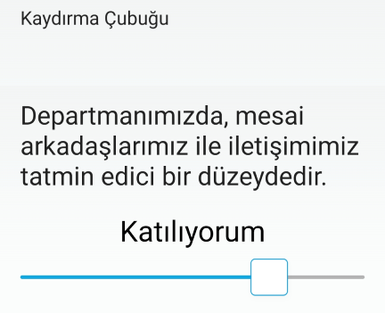
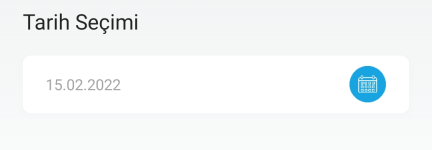

# :fontawesome-solid-square-poll-vertical: Anketler

Detaylı anketler hazırlayarak tüm çalışanlarınızın görüşlerini alabilirsiniz.

Bir [anket tanımladıktan](#anket-tanimla) sonra ilgili anket **Düzenle** butonu ile açılır ve [ankete soru eklenir](#yeni-soru-olustur).

## :fontawesome-solid-square-poll-vertical: Anket Listesi

Oluşturulmuş anketler ve anket raporları burada gösterilir, düzenlenir ya da silinir.

### Anket Raporları

Tüm anket raporları, Excel ve PDF formatında indirilebilir ya da yazdırılabilir.

#### Özet Rapor

Anket sorularına verilmiş cevap adetlerinin listelendiği rapordur.

#### Detay Raporu

[Soru grubu](#soru-gruplari-kullanarak-anket-olusturma) kullanılan anketlerin cevaplarının yüzdeleri ile birlikte listelendiği rapordur.

#### Katılımcı Bazlı Anket Raporu

Anket sorularına kimin, hangi cevabı verdiğinin listelendiği rapordur.

!!! note "Not"

    **Anonim** olarak yayınlanmış anketlerde kullanıcı isimleri "Anonim" olarak görünür.

### Anket Kopyala

İlgili anketin bir kopyasını oluşturur.

### Düzenle

İlgili anketin düzenlenebileceği ekrandır. Sayfadaki özellikler için bkz: [Anket Tanımla](#anket-tanimla)

### Sil

İlgili anketin silinmesini sağlar.

## Yeni Anket Oluştur

### Anket Tanımla

Seçili kullanıcıların katılabileceği yeni bir anket oluşturmak için kullanılır.

| Özellik                         | Açıklama                                                     |
| ------------------------------- | ------------------------------------------------------------ |
| Bildirim Gönderme Durumu        | Açık olması halinde; anket yayımlandığı anda, alıcılara bildirim gönderilir. |
| Başlık                          | Anket başlığı.                                               |
| Açıklama                        | Anket açıklaması.                                            |
| Aktif                           | Aktif olması durumunda anket görünür, Pasif olması durumunda görünmez. |
| Anket Eforu (Dakika)            | Anketi tamamlamak için tahmini süre.                         |
| Anket Başlangıç Tarihi          | Anket, seçilen tarihten sonra görünür olur. Yayımlanma tarihi geldiğinde -aktifleştirildiyse- kullanıcılara bildirim gider. |
| Tamamlamayanlara Hatırlat       | Anket tamamlamayan kişilere gönderilecek uyarının açıldığı bölümdür.
| Anket Bitiş Tarihi              | Anket, seçilen tarihten sonra kapanır. Yayımlanma tarihi geldiğinde -aktifleştirildiyse- kullanıcılara bildirim gider. |
| Liste Görseli                   | Anket tamamlandığında, tamamlanan anketler listesinde gösterilecek görseldir. Tavsiye edilen görsel boyutu: 1080 x 1080 px (1:1 oran) |
| Galeri Görseli                  | Anket galerisinde gösterilecek görseldir. Tavsiye edilen görsel boyutu: 1080 x 720 px (3:2 oran) |
| Soru Grubu Oluştur              | Anket soruları gruplanarak farklı türde raporlar elde edilebilir. Soru grupları hakkında detaylı açıklama için bkz: [Soru Grupları Kullanarak Anket Oluşturma](#soru-gruplari-kullanarak-anket-olusturma) |
| Katılımcı Bilgileri Raporlansın | "Evet" seçilmesi hâlinde ankete katılan kullanıcıların isimleri raporlanabilir. "Hayır" seçilmesi hâlinde anket anonim olarak yayınlanır. Katılımcılar ankete başlamadan önce anketin anonim olup olmadığını görürler. |
| Tüm Kullanıcılara Gönderilsin   | Aktif olması durumunda anket tüm kullanıcılara gönderilir. Pasif olması durumunda Alıcılar Listesi görünür olur ve içeriğin iletileceği kullanıcıları seçmek gerekir. |

### Alıcılar Listesi

Anketin gideceği kullanıcıların ya da kullanıcı gruplarının seçildiği alandır.

### Tanımlı Alıcı Listesi

Anketin hangi kullanıcılara yayımlandığının listesidir.

### Anketi Kaydetme ve Yayınlama

Yeni bir anket oluşturduğunuzda **Taslağı Kaydet** butonu ile çalışmanızı kaydedebilirsiniz. Taslak olarak kaydedilmiş anketler henüz mobil uygulamadan erişilebilir olmayacaktır. Ankete soru eklemeyi tamamladıktan sonra anketi yayınlamak için **Yayınla** butonuna tıklayabilirsiniz. Bu durumda kullanıcılar mobil uygulamadan ankete erişebilirler.

!!! note "Not"

    Mobil Yaka uygulaması üzerinden anketi tamamlamış kullanıcı, anketi tamamladığını aynı penceredeki listeden görür.
    
    Kullanıcı ankete katılmadı ise anket bitiş tarihi geldiğinde bu anketi bir daha göremez.
    
    Aktiflik durumu "Pasif" seçilirse anket kullanıcılara tamamen görünmez hâle gelir.
    
    Herhangi bir sebeple anketi kaçıran kullanıcılarınız için tekrar aynı anketi oluşturmak yerine, oylama bitiş tarihini uzatabilirsiniz. Bu durumda anketi tamamlamış kullanıcılar için anket tekrar açılmayacaktır.

!!! note "Ankete soru ekleme"

    **Kaydet** butonuna tıkladığınızda Anket Listesi sayfasına yönlendirilirsiniz. [Yeni Soru Oluştur](#yeni-soru-olustur) butonuna tıklayınız. Ankete soru ekleyerek, oluşturduğunuz anketi **Kaydet **butonu ile kaydedebilirsiniz.

## Anket Düzenle

### Yeni Soru Oluştur

Bir ankete birden fazla soru eklenebilir.

| Özellik              | Açıklama                                                     |
| -------------------- | ------------------------------------------------------------ |
| Soru Metni           | -                                                            |
| Aktif | Aktif olması durumunda soru, anket içerisinde görünür. Pasif olması durumunda görünmez. |
| Soru Tipi Seçiniz    | Aşağıdaki tiplerde soru oluşturulabilir. Soru tiplerinin uygulamada nasıl göründüğünü görmek için bkz: [Soru Tipleri](#soru-tipleri) <ul><li>Çoktan Seçmeli</li><li>Dörtlü Kutu</li><li>Kaydırma Çubuğu</li><li>Çoklu Seçim</li><li>Saat Seçimi</li><li>Tarih Seçimi</li><li>Açık Uçlu / Metin</li><li>Tekil Seçim</li></ul> |
| Seçilebilir Cevap Adedi           | Yalnızca "Çoklu Seçim" tipindeki sorularda kullanılabilir. Açıklama için bkz: [Çoklu Seçim](#coklu-secim) |
| "Diğer" seçeneği oluştur          | Yalnızca "Çoklu Seçim" ve "Tekil Seçim" tipindeki sorularda kullanılabilir. Açıklama için bkz: [Çoklu Seçim](#coklu-secim) ve [Tekil Seçim](#tekil-secim) |
| Soru Sırası          | -                                                            |

##### Soru Tipleri

###### Çoktan Seçmeli

Kullanıcı 4 adet seçenekten yalnızca birini seçer.

###### Dörtlü Kutu

Seçenekler kutu şeklinde görünür, bir adet seçim yapılabilir.

###### Kaydırma Çubuğu

Seçenekler kaydırma çubuğu olarak görünür. İstenen kadar seçenek eklenebilir, bir adet seçim yapılabilir.

###### Çoklu Seçim

İstenen kadar seçenek eklenebilir, birden fazla seçim yapılabilir.

!!! info "Çoklu Seçim tipindeki ekstra özellikler"

    Kullanıcılar, <strong>Seçilebilir Cevap Adedi</strong> alanında belirtilen adet kadar seçim yapabilir. Örneğin; kullanıcıların 6 cevap şıkkından en fazla 3 adet seçim yapmasını istiyorsanız, bu alana "3" yazabilirsiniz.

    <strong>"Diğer" seçeneği oluştur</strong> alanı, kullanıcılara sunduğunuz seçenekler dışında bir cevap yazma imkanı verir.    Örneğin: "Ana diliniz haricinde hangi dili biliyorsunuz?" sorusu için:
        <ul>
        <li>İngilizce</li>
        <li>Almanca</li>
        <li>İspanyolca</li>
        <li>Diğer</li>
        </ul>
    şıklarını hazırlarsanız, kullanıcılar "Diğer" kısmına "Fransızca" yazabilirler.

    <strong>"Diğer" seçeneği oluştur</strong> alanı [soru gruplu anketlerde](#soru-gruplari-kullanarak-anket-olusturma) kullanılamaz.

###### Saat Seçimi

###### Tarih Seçimi

###### Açık Uçlu / Metin

Kullanıcıların serbest metin girebileceği alandır.

###### Tekil Seçim

İstenen kadar seçenek eklenebilir, bir adet seçim yapılabilir.

!!! info "Tekil Seçim tipindeki ekstra özellikler"

    <strong>"Diğer" seçeneği oluştur</strong> alanı, kullanıcılara sunduğunuz seçenekler dışında bir cevap yazma imkanı verir.    Örneğin: "Ana diliniz haricinde hangi dili biliyorsunuz?" sorusu için:
        <ul>
        <li>İngilizce</li>
        <li>Almanca</li>
        <li>İspanyolca</li>
        <li>Diğer</li>
        </ul>
    şıklarını hazırlarsanız, kullanıcılar "Diğer" kısmına "Fransızca" yazabilirler.

    <strong>"Diğer" seçeneği oluştur</strong> alanı [soru gruplu anketlerde](#soru-gruplari-kullanarak-anket-olusturma) kullanılamaz.

#### Sonuçlar

İlgili anket sorusuna ait sonuçların görüntülenebileceği ekrandır. Eğer anket anonim değil ise, cevap veren kişi bilgisi de görüntülenir. Rapor, Excel ve PDF formatında indirilebilir ya da yazdırılabilir.

#### Düzenle

İlgili sorunun düzenlenebileceği ekrandır. Sayfadaki özellikler için bkz: [Yeni Soru Oluştur](#yeni-soru-olustur)

!!! warning "Uyarı"

    Anketi tamamlamış en az 1 kullanıcı olması hâlinde;
    
    - Sorularda düzenleme yapılamaz.
    
    - Soru eklenebilir ancak anketi tamamlamış olanlar bu yeni soruları yanıtlayamazlar.
    - "Katılımcı Bilgileri Raporlansın" seçeneği değiştirilemez.

#### Sil

İlgili sorunun silinmesini sağlar.

## Soru Grupları Kullanarak Anket Oluşturma

Belirli soruları gruplayarak çalışan memnuniyeti, departman performansı gibi anket türleriniz için detaylı raporlar elde edebilirsiniz.

Bir soru grubu başlığı altında birden fazla soru tanımlanabilir. Örneğin "Çalışan Memnuniyeti" anketi oluşturuyorsanız, aşağıdaki gibi 3 ana başlıkta gruplanmış 9 soruluk bir anket tanımlayabilirsiniz:

!!! tip ""

    <ul>
    <li><strong>Grup: Çalışma Ortamı ve Koşulları</strong>
        <ul>
        <li>Soru: Çalışma ortamında güvenlik önlemleri alınmaktadır.</li>
        <li>Soru: Çalışma ortamımızda hizmetleri yeterlidir.</li>
        <li>Soru: Çalışma ortamımızda aydınlatma yeterlidir.</li>
        </ul>
    </li>
    <li><strong>Grup: İletişim</strong>
        <ul>
        <li>Soru: Departmanımızda, yöneticilerimiz ile iletişimimiz tatmin edici bir düzeydedir.</li>
        <li>Soru: Departmanımızda, mesai arkadaşlarımız ile iletişimimiz tatmin edici bir düzeydedir.</li>
        <li>Soru: İnsan kaynaklarına taleplerimi iletebileceğim bir iletişim kanalı var.</li>
        </ul>
    </li>
    <li><strong>Grup: Çalışan Bilinci</strong>
        <ul>
        <li>Soru: Yaptığım işle ilgili inisiyatif kullanabiliyorum.</li>
        <li>Soru: Yaptığım iş ile ilgili benden ne beklendiğini iyi biliyorum.</li>
        <li>Soru: İşimle ilgili eğitime ihtiyaç duyduğumda firmam gerekli desteği sağlıyor.</li>
        </ul>
    </li>
    </ul>

    <strong>Cevap seçenekleri:</strong> Kesinlikle Katılıyorum, Katılıyorum, Kısmen Katılıyorum, Katılmıyorum, Kesinlikle Katılmıyorum

Anket sonucunda ise aşağıdakine benzer bir rapor oluşacaktır.

## Uygulama İçi Görünümü

??? info "Anket Listesi"

    <iframe width="300" height="533" src="https://xd.adobe.com/embed/a51929be-b754-4dc0-ad0d-97be0156061d-f04a/screen/f1fb2377-9d16-4d07-a0eb-286edd681cbf" frameborder="0" ></iframe>