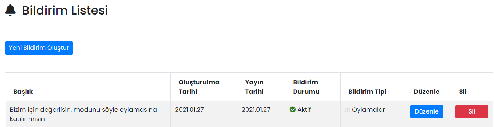

# :material-bell: Bildirimler

Mobil Yaka kullanıcılarına bildirim şeklinde mesajlar gönderilebilir.
## :material-bell: Bildirim Listesi
Oluşturulmuş bildirimler burada gösterilir, düzenlenir ya da silinir.

### Düzenle

İlgili bildirimin düzenlenebileceği ekrandır. Sayfadaki özellikler için bkz: [Bildirim Tanımla](#bildirim-tanimla)

### Sil

İlgili bildirimin silinmesini sağlar.

## Yeni Bildirim Oluştur

### Bildirim Tanımla

Kullanıcılara yeni bir bildirim göndermek için kullanılır.

| Özellik                       | Açıklama                                                     |
| ----------------------------- | ------------------------------------------------------------ |
| Başlık                        | Bildirim metnidir. En fazla 90 karakter olabilir.            |
| Bildirim Tipi Seçiniz         | Bildirimin hangi modül ile ilgili olduğudur. Mobil cihazdan bildirime tıklandığında, seçilen modül açılacaktır. |
| İçerik Dosyası Yükle          | Bildirim gönderirken üç adede kadar PDF dosyası paylaşabilirsiniz. Bildirim Tipi olarak "Bildiri" seçildiğinde görünür olur. |
| Yayınlanma Tarihi             | Bildirim, seçilen tarihte ve saatte yayınlanır.              |
| Tüm Kullanıcılara Gönderilsin | Aktif olması durumunda bildirim tüm kullanıcılara gönderilir. Pasif olması durumunda Alıcılar Listesi görünür olur ve içeriğin iletileceği kullanıcıları seçmek gerekir. |

??? success "Bildirimleri Onaya Gönderme"

    Bildirimler yayınlanmadan önce <b>Onaylanması</b> sağlanabilir. Bunun için:
    
    - Bildirimi <b>onaya gönderecek</b> kişinin yetkilerinin aşağıdaki gibi ayarlanması gereklidir:
        * "Yeni Bildirim Kaydet ve Onaya Gönder" ve "Bildirim Güncelle ve Onaya Gönder" yetkilerine sahip olması,
        * "Yeni Bildirim Kaydet ve Gönder" ve "Bildirim Güncelle ve Gönder" yetkilerine sahip <u>olmaması</u>.
    - Bildirimi <b>onaylayacak</b> kişinin yetkilerinin aşağıdaki gibi ayarlanması gereklidir:
        * "Yeni Bildirim Kaydet ve Gönder" ve "Bildirim Güncelle ve Gönder" yetkilerine sahip olması.
    
    Onay bekleyen bildirimler, bildirim listesinde Onay Durumu bilgisi "Bekleniyor" şeklinde görünür. Onaylayacak kişinin bildirimi düzenleyerek, "Güncelle ve Gönder" butonuna basması hâlinde bildirim yayınlanır.

### Alıcılar Listesi

Bildirimin gideceği kullanıcıların ya da kullanıcı gruplarının seçildiği alandır. Kullanıcı ya da gruplar ismine göre aranabilir.

### Tanımlı Alıcı Listesi

Bildirimin hangi kullanıcılara yayımlandığının listesidir.

## Uygulama İçi Görünümü

??? info "Bildirimler"

    <iframe width="300" height="533" src="https://xd.adobe.com/embed/a51929be-b754-4dc0-ad0d-97be0156061d-f04a/screen/3ff7f6d1-2aef-4649-b59d-78c99dc59745" frameborder="0" ></iframe>
