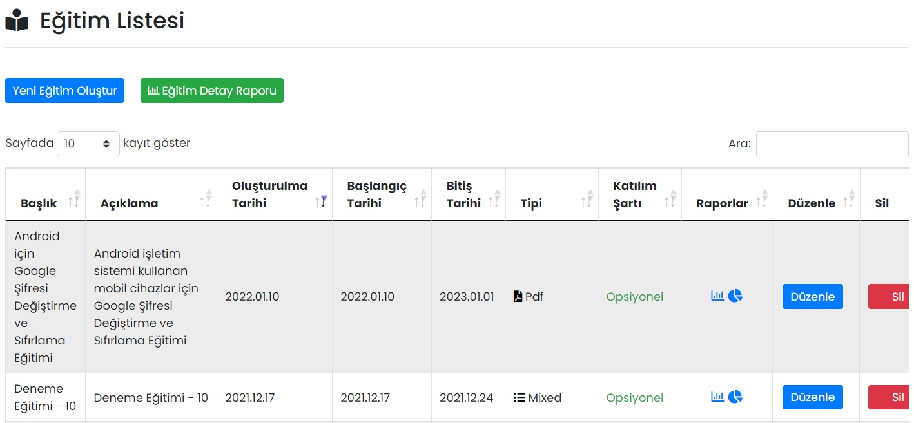

# :fontawesome-solid-chalkboard-user: Eğitimler

Mobil Yaka ile çalışanlarınıza eğitimler hazırlayabilirsiniz. Eğitim içeriği PDF, PowerPoint ve video olabilir. Eğitim sonunda çalışanlar test olabilir ve tüm sonuçlar raporlanabilir. Opsiyonel olarak, çalışanlarınız hazırladığınız eğitimleri uygulama içerisinden değerlendirebilir.

Eğitimler Derslerden, Dersler Testlerden, Testler ise Sorulardan oluşur. Bir eğitim içerisine birden çok ders, test ve soru eklenebilir.

## :fontawesome-solid-book-open-reader: Eğitim Listesi

Oluşturulmuş eğitimler burada gösterilir, düzenlenir ya da silinir.

### Eğitim Raporları

Eğitimler için 2 çeşit raporlama bulunur.

#### 	1. Katılımcı Bazlı Eğitim Raporu

​			Eğitime katılan kullanıcılar, başarı durumları ve puanları gibi raporların görüntülenebileceği ekrandır.

#### 	2. Eğitim Grafik Özet Raporları

​			Eğitimin genel ve ders bazlı raporlarının grafik olarak görüntülenebileceği ekrandır.

### Eğitim Kopyala

İlgili eğitimin bir kopyasını oluşturur.

### Düzenle

İlgili eğitimin düzenlenebileceği ekrandır. Sayfadaki özellikler için bkz: [Eğitim Tanımla](#egitim-tanimla)

### Sil

İlgili eğitimin silinmesini sağlar.

## Eğitim Detay Raporu

Tüm derslerin detaylı raporları burada görüntülenir. Rapor Excel/PDF olarak indirilebilir ya da yazdırılabilir.

## Yeni Eğitim Oluştur

### Eğitim Tanımla

| Özellik                       | Açıklama                                                     |
| ----------------------------- | ------------------------------------------------------------ |
| Bildirim Gönderme Durumu      | Açık olması hâlinde; eğitim yayımlandığı anda, katılımcılara bildirim gönderilir. |
| Başlık                        | -                                                            |
| Kısa Açıklama                 | -                                                            |
| Aktif          | Aktif olması durumunda eğitim görünür, Pasif olması durumunda görünmez. |
| Eğitim Tipi Seçiniz           | PDF, PowerPoint, video, web sitesi ya da mixed olarak seçilebilir. Seçeneğe göre eğitimin ikonu değişecektir. |
| Katılım Şartı                 | Kullanıcılara, bu eğitimin opsiyonel ya da zorunlu olduğu belirtilebilir. |
| Sertifika Verilme Durumu      | Eğitim tamamlandığında katılımcılara sertifika verilebilir. Aktif olması hâlinde "Sertifika URL Adresi" görünür olur. |
| Sertifika URL Adresi          | Kullanıcılara verilecek sertifikanın URL adresidir.          |
| Eğitim Görseli                | Eğitim açıldığında gösterilecek görseldir. Tavsiye edilen görsel boyutu: 1080 x 720 px (3:2 oran) |
| Eğitim Başlangıç Tarihi       | Eğitim bu tarihten sonra görünür olur.                       |
| Eğitim Bitiş Tarihi           | Eğitim bu tarihten sonra görünmez.                           |
| Tüm Kullanıcılara Gönderilsin | Aktif olması durumunda eğitim tüm kullanıcılara atanır. Pasif olması durumunda Alıcılar Listesi görünür olur ve eğitimin atanacağı kullanıcıları seçmek gerekir. |

### Alıcılar Listesi

Eğitimin yayımlanacağı kullanıcıların ya da kullanıcı gruplarının seçildiği alandır.

### Tanımlı Alıcı Listesi

Eğitimin hangi kullanıcılara yayımlandığının listesidir.

### Eğitimi Kaydetme ve Yayınlama

Yeni bir eğitim oluşturduğunuzda **Taslağı Kaydet** butonu ile çalışmanızı kaydedebilirsiniz. Taslak olarak kaydedilmiş eğitimler henüz mobil uygulamadan erişilebilir olmayacaktır. Eğitime ders ve test eklemeyi tamamladıktan sonra eğitimi yayınlamak için **Yayınla** butonuna tıklayabilirsiniz. Bu durumda kullanıcılar mobil uygulamadan eğitime erişebilirler.

!!! note "Eğitime ders ekleme"

    **Taslağı Kaydet** butonuna tıkladığınızda Eğitim Listesi sayfasına yönlendirilirsiniz. Eğitime ders eklemek için, oluşturduğunuz eğimi **Düzenle **butonu ile açıp [Yeni Ders Oluştur](#ders-tanimla) butonuna tıklayınız.

## Yeni Ders Oluştur

### Ders Tanımla

| Özellik                   | Açıklama                                                     |
| ------------------------- | ------------------------------------------------------------ |
| Başlık                    | -                                                            |
| Açıklama                  | -                                                            |
| Aktif      | Aktif olması durumunda ders görünür, Pasif olması durumunda görünmez. |
| Eğitim Tipi Seçiniz       | PDF, PowerPoint, video, web sitesi ya da mixed olarak seçilebilir. Seçeneğe göre dersin ikonu değişecektir. |
| İçerik Dosyası Yükle      | PDF ve PowerPoint içerikli eğitimler içindir.                |
| Video URL Adresi          | Video içerikli eğitimler içindir. Şimdilik sadece YouTube linkleri çalışmaktadır. |
| Web URL Adresi          | Ders açıldığında, kullanıcıları bir web sitesine yönlendirmek için kullanılır. Kullanıcılar linkteki eğitim içeriğine eriştikten sonra Mobil Yaka uygulamasına dönüp dersi tamamlayabilirler. |
| Eğitim Kategorisi Seçiniz | -                                                            |
| Ders Sırası               | Dersin, eğitimlerde hangi sırada olduğu değiştirilebilir.    |
| Ders Eforu (Dakika)       | Dersin tahminî tamamlanma süresidir.                         |
| Ders Öncesi Test Oluştur | Kullanıcıların, dersten önce ve dersten sonraki bilgi seviyesini ölçmek için kullanılır. Detaylı bilgi için aşağıdaki [Ders öncesi test oluşturma](#ders-oncesi-test-olusturma) kutucuğuna bakınız. |

??? abstract "Ders öncesi test oluşturma"

	Kullanıcıların, dersten önce ve dersten sonraki bilgi seviyesini ölçmek için ders öncesi testler oluşturabilirsiniz.

    Ders öncesi testi aktifleştirdiğinizde:

    - Derse en az iki test eklenmelidir. Test oluştururken "Test Tipi Seçiniz" kısmından "Ders Öncesi Test" ve "Ders Sonrası Test" şeklinde seçim yapabilirsiniz.
    - Kullanıcılar mobil uygulamadan dersi açtığında, ilk önce ders öncesi testi tamamlamaları gerektiğine dair mesaj görürler. Bu test tamamlanmadan ders içeriğine ulaşılamaz.
    - Ders öncesi test ve ders tamamlandıktan sonra kullanıcılar ders sonrası testi çözebilir.
    - Kullanıcıların ders öncesi ve sonrası gelişimlerini sunmak için üç farklı rapor oluşur:
        * [Katılımcı Bazlı Eğitim Raporunda](#katilimci-bazli-egitim-raporu) her kullanıcının bireysel gelişim oranı grafiklerle gösterilir. Gösterilen gelişim oranı, tüm derslerin toplamının ortalamasıdır.
        * [Ders Özet Raporunda](#ders-ozet-raporu) dersteki tüm katılımcıların gelişim oranlarının ortalaması grafiklerle gösterilir.
        * [Katılımcılar Raporunda](#katilimcilar-raporu) gelişim oranları her kullanıcı için ayrı ayrı gösterilir.

### Ders Raporları

Dersler için 2 çeşit raporlama bulunur.

#### 	1. Ders Özet Raporu

Ders Sonuç Grafiği, dersin testlerindeki başarılı ve başarısız katılımcı oranını gösterir.

Ders Gelişim Grafiği, testlerdeki katılımcı gelişim yüzdelerini gösterir.

#### 	2. Katılımcılar Raporu

Dersin testlerini tamamlayanların listesini ve gelişim yüzdesini gösterir.

!!! note "Derse test ekleme"

	**Kaydet** butonuna tıkladığınızda Eğitim Düzenle sayfasına yönlendirilirsiniz. Derse test eklemek için, oluşturduğunuz dersi **Düzenle **butonu ile açıp [Yeni Test Oluştur](#test-tanimla) butonuna tıklayınız.

## Yeni Test Oluştur

### Test Tanımla

| Özellik                      | Açıklama                                                     |
| ---------------------------- | ------------------------------------------------------------ |
| Başlık                       | -                                                            |
| Açıklama                     | -                                                            |
| Başarısız Kullanıcılar Testi Tekrar Çözebilsin | Aktif olması halinde, testten başarısız olan bir çalışan o testi tekrar çözebililir. |
| Test Tekrar Sayısı | Çalışanın testi kaç defa tekrarlayacağı limiti girilebilir. Örneğin 3 yazarsanız, çalışan 3. defa başarısız olduktan sonra testi tekrar alamaz. |
| Test Tipi Seçiniz            | Ders öncesi test kullanıldığında, yeni oluşturulan testin dersten önce mi yoksa sonra mı yapılacağını belirtir. |
| Aktif         | Aktif olması durumunda test görünür, Pasif olması durumunda görünmez. |
| Test Süresi (Dakika)         | Testin tahminî tamamlanma süresidir.                         |
| Başarı Kriteri Puanı (1-100) | Kullanıcının bir testten başarılı olabilmesi için 100 üzerinden alması gereken puandır. |

!!! note "Teste soru ekleme"

	**Kaydet** butonuna tıkladığınızda Ders Güncelle sayfasına yönlendirilirsiniz. Teste soru eklemek için, oluşturduğunuz testi **Düzenle **butonu ile açıp [Yeni Soru Oluştur](#soru-tanimla) butonuna tıklayınız.

## Yeni Soru Oluştur

### Soru Tanımla

| Özellik              | Açıklama                                                     |
| -------------------- | ------------------------------------------------------------ |
| Soru Metni           | -                                                            |
| Aktif | Aktif olması durumunda soru görünür, Pasif olması durumunda görünmez. |
| Cevap Metni          | Cevap seçenekleri bölümünde bir soru için 4 adet cevap seçeneği oluşturulmaktadır. |

### Test Raporları

#### 	Cevap Listesi

Cevap listesinde, teste katılan kullanıcıların hangi cevapları verdikleri ve bu cevapların doğru mu yanlış mı olduğu listelenir. Tabloda kişi adı, soru, cevap ve doğru / yanlış bilgisine göre arama yapılabilir.

### Karekod ile Eğitim Yayınlama
Tamamlanan eğitim linklerini karekod ile çalışanlarınıza ulaştırabilirsiniz. Tanımlanan karekodu çıkarıp herhangi bir mecradan yönlendirebilir, bu karekodla eğitimleri çalışanlarınıza direkt olarak iletebilirsiniz.

## Uygulama İçi Görünümü

??? info "Eğitim Listesi"

    <iframe width="300" height="533" src="https://xd.adobe.com/embed/a51929be-b754-4dc0-ad0d-97be0156061d-f04a/screen/acdd16ce-8cae-4852-8821-d714c72c5e35" frameborder="0" ></iframe>

??? info "Ders"

    <iframe width="300" height="533" src="https://xd.adobe.com/embed/a51929be-b754-4dc0-ad0d-97be0156061d-f04a/screen/022909b0-1ac4-4f74-ab9c-3862b1cc133b" frameborder="0" ></iframe>

??? info "Test"

    <iframe width="300" height="533" src="https://xd.adobe.com/embed/a51929be-b754-4dc0-ad0d-97be0156061d-f04a/screen/3d005e22-a280-4aa2-ab9d-7e1310aa2c12" frameborder="0" ></iframe>