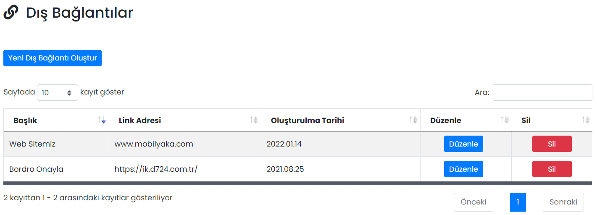

# :fontawesome-solid-building: Firma Bilgileri

## :fontawesome-solid-link: Dış Bağlantılar

Çalışanların sık kullanacağı web siteleri (örneğin firmanızın web sitesi) dış bağlantı olarak eklenebilir. Eklenen dış bağlantılar, Mobil Yaka uygulaması içerisinde sağ taraftaki hamburger menüde görüntülenir.

### Düzenle

İlgili dış bağlantının düzenlenebileceği ekrandır. Sayfadaki özellikler için bkz: [Dış Bağlantı Tanımla](#dis-baglanti-tanimla)

### Sil

İlgili dış bağlantının silinmesini sağlar.

## Yeni Dış Bağlantı Oluştur

### Dış Bağlantı Tanımla

Yeni bir dış bağlantı oluşturmayı sağlar.

| Özellik           | Açıklama                                                     |
| ----------------- | ------------------------------------------------------------ |
| Başlık            | -                                                            |
| Link Adresi       | -                                                            |
| Görüntüleme Şekli | "Tarayıcıda" seçilmesi halinde link, mobil cihazdaki tarayıcı uygulamasında açılır. "Uygulamada" seçilmesi halinde link, Mobil Yaka uygulamasından çıkmadan, uygulama içerisinde açılır. |

## Uygulama İçi Görünümü

??? info "Dış Bağlantılar"

    <iframe width="300" height="533" src="https://xd.adobe.com/embed/a51929be-b754-4dc0-ad0d-97be0156061d-f04a/screen/3060187c-af7a-494a-8a4e-65b0ef124594" frameborder="0" ></iframe>

