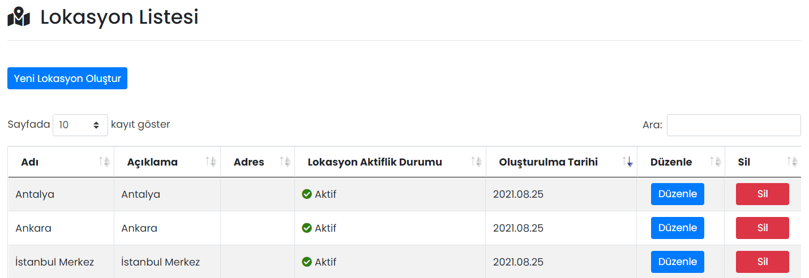

# :fontawesome-solid-building: Firma Bilgileri

## :fontawesome-solid-map-location-dot: Lokasyonlar

Firmanız için birden fazla lokasyon tanımlanabilir.

### Düzenle

İlgili lokasyonun düzenlenebileceği ekrandır. Sayfadaki özellikler için bkz: [Lokasyon Tanımla](#lokasyon-tanimla)

### Sil

İlgili lokasyonun silinmesini sağlar.

!!! warning "Uyarı"

    Bir lokasyon silindiğinde, departmana bağlı kullanıcıların "Konum Bilgisi" silinmez, eski hâli ile kalmaya devam eder.

## Yeni Lokasyon Oluştur

### Lokasyon Tanımla

Yeni bir lokasyon oluşturmayı sağlar.

| Özellik              | Açıklama                                                     |
| -------------------- | ------------------------------------------------------------ |
| Lokasyon Adı         | -                                                            |
| Lokasyon Açıklaması  | Bilgi amaçlıdır, herhangi bir şekilde kullanıcılara gösterilmez. |
| Adres                | Bilgi amaçlıdır, herhangi bir şekilde kullanıcılara gösterilmez. |
| Aktif                | Aktif olması durumunda lokasyon, kullanıcı eklerken görünür, Pasif olması durumunda görünmez. |

