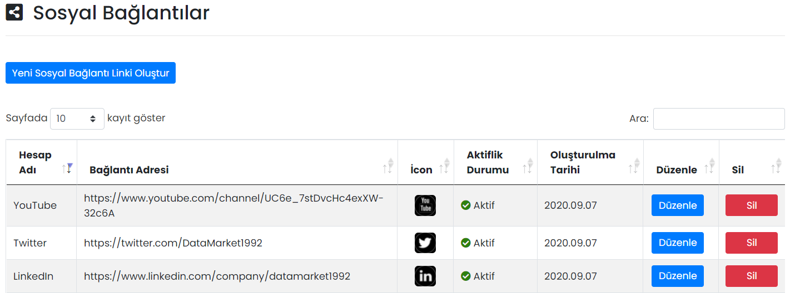

# :fontawesome-solid-building: Firma Bilgileri

## :fontawesome-solid-square-share-nodes: Sosyal Bağlantılar

Mobil Yaka uygulaması içerisinde sağ taraftaki hamburger menüde görüntülenecek sosyal bağlantılar eklenebilir.

Firmanızın sosyal bağlantılarına kısayollar eklenebilir. Eklenen dış bağlantılar, Mobil Yaka uygulaması içerisinde sağ taraftaki hamburger menüde görüntülenir.

### Düzenle

İlgili bağlantının düzenlenebileceği ekrandır.

| Özellik              | Açıklama                                                     |
| -------------------- | ------------------------------------------------------------ |
| Link                 | -                                                            |
| Aktif                | Aktif olması durumunda sosyal bağlantı görünür, Pasif olması durumunda görünmez. |

### Sil

İlgili bağlantının silinmesini sağlar.

## Yeni Sosyal Bağlantı Linki Oluştur

### Sosyal Bağlantı Tanımla

Aşağıdaki platformlar için sosyal bağlantı linkleri oluşturulabilir:

- LinkedIn
- Facebook
- Twitter
- Instagram
- YouTube

!!! note "Not"

    Eklenmesini istediğiniz bir platform olması hâlinde firmamız ile iletişime geçebilirsiniz.

## Uygulama İçi Görünümü

??? info "Sosyal Bağlantılar"

    <iframe width="300" height="533" src="https://xd.adobe.com/embed/a51929be-b754-4dc0-ad0d-97be0156061d-f04a/screen/3060187c-af7a-494a-8a4e-65b0ef124594" frameborder="0" ></iframe>
