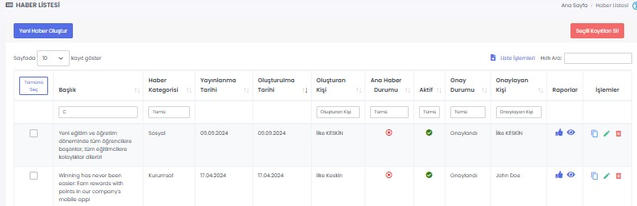
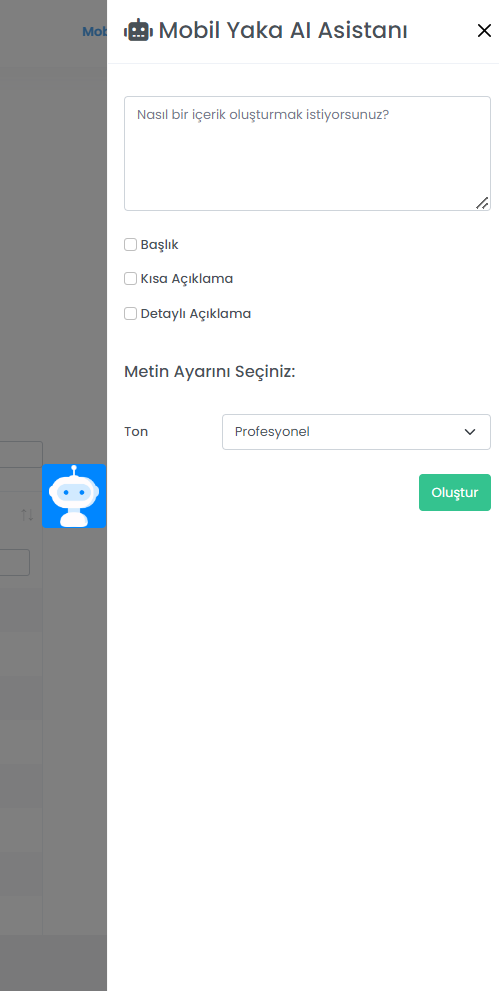

# :fontawesome-regular-newspaper: Haberler
Firmanız ile ilgili haber, duyuru ve gelişmeleri çalışanlarınızla paylaşabilirsiniz.

## :fontawesome-regular-newspaper: Haber Listesi
Oluşturulmuş haberler burada gösterilir, düzenlenir ya da silinir. Haber başlıklarına göre arama yapılabilir.

### Etkileşim Raporu

İlgili haberin beğeni ve yorumlarının listelendiği ekrandır.

### Haber Görüntülenme Raporu

İlgili haberin toplamda kaç defa görüntülendiği, haberi görüntüleyen ve görüntülemeyen kullanıcıların listelendiği ekrandır.

### Haber Kopyala

İlgili haberin bir kopyasını oluşturur.

### Haber Düzenle

İlgili haberin düzenlenebileceği ekrandır. Sayfadaki özellikler için bkz: [Haber Tanımla](#haber-tanimla)

### Haber Sil

İlgili haberin silinmesini sağlar.

## Yeni Haber Oluştur

### Haber Tanımla

Haberler bölümünde yeni bir haber yayımlamak için kullanılır.

| Özellik                       | Açıklama                                                     |
| ----------------------------- | ------------------------------------------------------------ |
| Bildirim Gönderme Durumu      | Açık olması halinde; haber yayımlandığı anda alıcılara bildirim gönderilir. |
| Başlık                        | Haber başlığı. En fazla 100 karakter olabilir.               |
| Kısa Açıklama                 | Başlığın altında görüntülenecek kısa açıklama. En fazla 250 karakter olabilir. |
| Detaylı Açıklama              | Haberin ana metnidir.                                        |
| Aktif                         | Aktif olması durumunda haber görünür, Pasif olması durumunda görünmez. |
| Ana Haber Durumu              | Aktif olması durumunda haber, haberler sayfasının üstünde bulunan kaydırılabilir haberler kısmında görünür. Ana haber olarak girilmiş son 10 haber bu kısımda listelenir. |
| Detay Video YouTube Link      | Haber içeriğine YouTube videosu eklenebilir. Eklenen video, Detay Görseli yerine görüntülenecektir. |
| İçerik Görseli                | Haber listesinde gösterilecek görseldir. Tavsiye edilen görsel boyutu: 1080 x 432 px (5:2 oran) Ana haber için tavsiye edilen görsel boyutu: 1080 x 810 (4:3 oran) |
| Detay Görseli                 | Haber açıldığında gösterilecek görseldir. Tavsiye edilen görsel boyutu: 1080 x 540 px (2:1 oran) |
| Haber Galerisi Kullan         | Gireceğiniz haberin içerisinde bir [Fotoğraf Galerisi](/yardim/anasayfa/fotograf-galerisi/fotograf-galerisi) oluşturulmasını sağlar. Aktif olması durumunda, "Galeri" alanından var olan bir fotoğraf galerisi seçebilir veya "[Yeni Galeri Oluştur](/yardim/anasayfa/fotograf-galerisi/fotograf-galerisi/#galeri-tanimla)" seçeneği ile oluşturabilirsiniz. |
| Haber Kategorisi              | Haberler, uygulama içerisinde kategorilerine göre ayrılmış olarak listelenir. |
| İçerik Dosyası Yükle          | Haber içeriğine PDF dosyası eklenebilir. Kullanıcılar dosyayı cihazlarına indirerek görüntüleyebilirler. |
| Yayınlanma Tarihi             | Haber, seçilen tarihten sonra görünür olur. Yayımlanma tarihi geldiğinde -aktifleştirildiyse- kullanıcılara bildirim gider. |
| Tüm Kullanıcılara Gönderilsin | Aktif olması durumunda içerik tüm kullanıcılar ile paylaşılır. Pasif olması durumunda Alıcılar Listesi görünür olur ve içeriğin iletileceği kullanıcıları seçmek gerekir. |

??? success "Haberleri Onaya Gönderme"

    Haberlerin yayınlanmadan önce <b>Onaylanması</b> sağlanabilir. Bunun için:
    
    - Haberi <b>onaya gönderecek</b> kişinin yetkilerinin aşağıdaki gibi ayarlanması gereklidir:
        * "Yeni Haber Kaydet ve Onaya Gönder" ve "Haber Güncelle ve Onaya Gönder" yetkilerine sahip olması,
        * "Yeni Haber Kaydet ve Gönder" ve "Haber Güncelle ve Gönder" yetkilerine sahip <u>olmaması</u>.
    - Haberi <b>onaylayacak</b> kişinin yetkilerinin aşağıdaki gibi ayarlanması gereklidir:
        * "Yeni Haber Kaydet ve Gönder" ve "Haber Güncelle ve Gönder" yetkilerine sahip olması.
    
    Onay bekleyen haberler, haber listesinde Onay Durumu bilgisi "Bekleniyor" şeklinde görünür. Onaylayacak kişinin haberi düzenleyerek, "Güncelle ve Gönder" butonuna basması hâlinde haber yayınlanır.

### Alıcılar Listesi

Haberin yayımlandığı kullanıcıların ya da kullanıcı gruplarının seçildiği alandır. Kullanıcı ya da gruplar ismine göre aranabilir.

### Tanımlı Alıcı Listesi

Haberin hangi kullanıcılara yayımlandığının listesidir.

### Zengin Metin İçeriği İpuçları

??? info "Zengin Metin İçeriği Örneği"

    

- Haberi yayınlamadan mobil cihazda önizlemesini görmek için araç çubuğundaki "Ön İzleme" butonuna tıklayabilirsiniz.
- Haber içerisinde "emojiler" kullanabilirsiniz.
	* Chrome ya da Edge internet tarayıcısı kullanıyor iseniz: Emoji eklemek istediğiniz alana sağ tıklayarak "Emoji"yi seçin. Çıkan küçük pencerede arama yaparak istediğiniz emojiyi ekleyebilirsiniz.
	* Başka bir kaynaktan kopyalamak için: Bir emoji sitesinden (örn: [www.emojipedia.org](https://emojipedia.org/)) arama yaparak kopyalayabilirsiniz.
- Klavye kısayolları kullanabilirsiniz:
	* **CTRL + Z:** Geri Al, **CTRL + Y**: Yinele
	* **CTRL + B**: **Metni kalınlaştır**, **CTRL + U:** <u>Altını çiz</u>, **CTRL + I:** *İtalik*
- URL (Link) ile görsel ekleyebilirsiniz. Görseli bir resim saklama sitesine yükleyip (örn: [www.hizliresim.com](https://hizliresim.com/)) oluşan linki imaj uzantısıyla birlikte kopyalayın (örn: `https://i.hizliresim.com/97s5s9g.png`). Araç çubuğundaki "Resim Ekle" butonuna basın ve URL'i yapıştırın.

### Karekod ile Haber Yayınlama
Tamamlanan haber linklerini karekod ile çalışanlarınıza ulaştırabilirsiniz. Tanımlanan karekodu çıkarıp herhangi bir mecradan yönlendirebilir, bu karekodla haberleri çalışanlarınıza direkt olarak iletebilirsiniz.

## :fontawesome-regular-newspaper: Yapay Zeka ile Haber Oluşturma
**Yeni Haber Oluştur** sekmesi altında bulunan yapay zeka asistanı sayesinde yeni bir içerik oluşturmak için yapay zekadan yararlanabilirsiniz.

| Özellik                       | Açıklama                                                     |
| ----------------------------- | ------------------------------------------------------------ |
| Haber İçeriği                 | Yapay Zeka içeriğini oluşturmak için öneriler eklenir |
| Başlık                        | Yapay Zeka ile Oluşturulacak içeriğin haber başlığı olmasını sağlayan seçenektir    |
| Kısa Açıklama                 | Yapay Zeka ile Oluşturulacak içeriğin kısa açıklama olmasını sağlayan seçenektir |
| Detaylı Açıklama              | Yapay Zeka ile Oluşturulacak içeriğin detaylı açıklama olmasını sağlayan seçenektir       
| Ton                           | Metin oluştururken tonlama ile alakalı ayarlamalar yapabilirsiniz.

| Metin Ayarı                   | Ton                                                          |
| ----------------------------- | ------------------------------------------------------------ |
| Profesyonel                   | Yapay zekanın daha profesyonel bir dille haber içeriği oluşturmasını sağlar |
| Eğlenceli                     | Yapay zekanın daha eğlenceli bir dille haber içeriği oluşturmasını sağlar |

## Uygulama İçi Görünümü

??? info "Haber Listesi"

    <iframe width="300" height="533" src="https://xd.adobe.com/embed/a51929be-b754-4dc0-ad0d-97be0156061d-f04a/screen/01a13408-4a01-4f0b-a591-8c8184766c1a/" frameborder="0" ></iframe>
