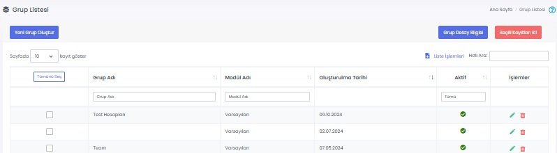

# :material-layers-triple: Kullanıcı Grupları

## :material-layers-triple: Grup Listesi

Kullanıcıların daha kolay yönetimi için kullanıcı grupları oluşturulabilir. Bir içerik yayımlanırken tek tek kullanıcıları seçmek yerine, bağlı oldukları grubu seçerek yönetimlerini kolaylaştırabilirsiniz.

Öneriler ve Ramak Kala bildirimlerini e-posta olarak almaları için de ayrı gruplar oluşturabilirsiniz.

### Düzenle

İlgili grubun düzenlenebileceği ve gruba yeni kullanıcıların eklenebileceği ekrandır. Sayfadaki özellikler için bkz: [Grup Tanımla](#grup-tanimla)

### Sil

İlgili grubun silinmesini sağlar.

## Yeni Grup Oluştur

### Grup Tanımla

Yeni bir kullanıcı grubu oluşturmak için kullanılır.

| Özellik              | Açıklama                                                     |
| -------------------- | ------------------------------------------------------------ |
| Grup Adı             | -                                                            |
| Modül Adı            |  <ul><li>Varsayılan, Ramak Kala veya Öneriler olarak seçilebilir.</li><li>"Ramak Kala" veya "Öneriler" seçildiğinde, Mobil Yaka uygulamasındaki ilgili modülden iletilen gönderiler, gruptaki kişilere e-posta olarak gider.</li><li>"Varsayılan" ise diğer tüm modüller için kullanılabilir. Örneğin; belli bir haberi sadece Pazarlama ekibinin görmesini istiyorsanız, "Pazarlama" kullanıcı grubu oluşturup kişileri gruba ekledikten sonra, haber alıcısı listesinden "Pazarlama" grubunu seçebilirsiniz. Haberi yalnızca Pazarlama ekibi görecektir.</li></ul> |
| Aktif                | Aktif olması durumunda grup görünür, Pasif olması durumunda görünmez. |

### Gruba Kullanıcı Ekle

İlgili gruba yeni kullanıcıların eklendiği ekrandır.

### Seçili Kullanıcıları Gruptan Sil

İlgili gruptaki kullanıcıların gruptan çıkarılmasını sağlar.