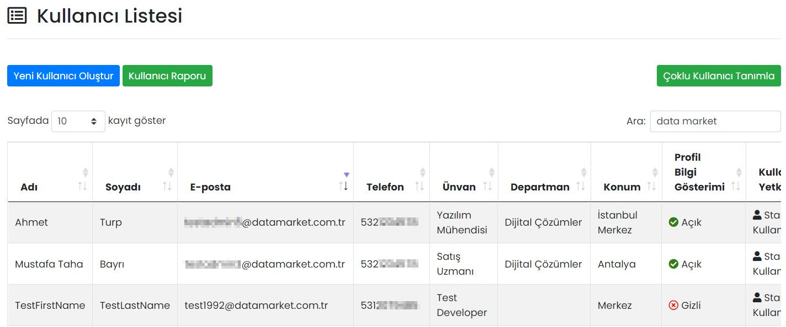
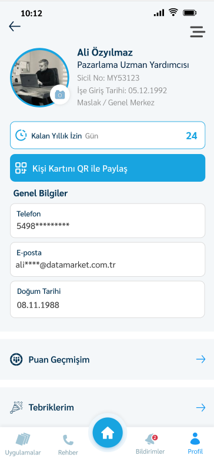

# :fontawesome-solid-user-gear: Kullanıcılar

## :fontawesome-solid-list: Kullanıcı Listesi

Firmanızdaki Mobil Yaka kullanıcıları burada gösterilir, düzenlenir ya da silinir. Arama özelliği ile, kullanıcı listesindeki herhangi bir bilgiye göre arama yapılabilir.

### Düzenle

İlgili kullanıcıya ait bilgilerin düzenlenebileceği ekrandır. Sayfadaki özellikler için bkz: [Kullanıcı Tanımla](#kullanici-tanimla)

### Sil

İlgili kullanıcının silinmesini sağlar.

## Yeni Kullanıcı Oluştur

###  :octicons-person-add-24: Kullanıcı Tanımla

| Özellik                | Açıklama                                                     |
| ---------------------- | ------------------------------------------------------------ |
| Adı                    | -                                                            |
| Soyadı                 | -                                                            |
| E-posta                | Kullanıcının e-posta adresidir.                              |
| Telefon                | Kullanıcının telefon numarasıdır. Aynı telefon numarası ile birden fazla kullanıcı tanımlanamaz. |
| Ünvan                  | Kullanıcının firma içerisindeki ünvanıdır.                   |
| Konum Bilgisi          | Kullanıcının, firmanızın hangi lokasyonuna bağlı olduğu bilgisidir. |
| Departman Bilgisi      | Kullanıcının, firmanızın hangi departmanında olduğu bilgisidir. |
| Doğum Tarihi           | -                                                            |
| İşe Giriş Tarihi       | -                                                            |
| Profil Resmi           | Kullanıcıya ait profil resmidir. Tavsiye edilen görsel boyutu: 1080 x 1080 px (1:1 oran) |
| Profil Bilgi Gösterimi | "Açık" olması hâlinde kullanıcıya ait bilgiler Rehber uygulamasında görünür. "Gizli" olması hâlinde görünmez. Not: Mobil uygulamadaki Rehber uygulamasında, kullanıcı sadece kendi departmanındaki kişileri listede görebilir. Profil gösterimi açık diğer kişileri ise arama çubuğundan arama yaparak bulabilir. |
| Rehber Yetki Tanımı  | "Evet" olması hâlinde kullanıcı Rehber uygulamasına ve rehberdeki kişilere erişim sağlayabilir. |
| Yönetici Yetki Tanımı  | Aktifleştirilmesi hâlinde kullanıcıya Mobil Yaka Web Portalı erişim yetkisi verilir. Yönetici Yetki Tanımına sahip kullanıcılar, yalnızca kendilerine yetki verilmiş modülleri görebilirler. |
| Süper Yönetici Yetki Tanımı  | Aktifleştirilmesi hâlinde kullanıcıya Mobil Yaka Web Portalı erişim yetkisi verilir. Süper Yönetici Yetki Tanımına sahip kullanıcılar, Mobil Yaka'daki tüm özelliklere erişebilir. |

## Kişi Kartını QR ile Paylaş

Oluşturulan her kişi kartı ile birlikte kişinin Mobilyaka profilinde bulunan bazı bilgilerinin QR ile paylaşılması için profil sayfasında bir buton bulunur.

Bu buton yardımı ile ekrana bir QR yaratılır ve bu QR okutan telefona profil bilgilerinin bulunduğu kişi kartı eklenebilmesi için bilgi gönderilir.

## Kullanıcı Raporu

Mobil Yaka'da kullanıcı hesabı olup, hiç giriş yapmamış kullanıcıları listeleyen raporu görüntüler.

!!! info "Bilgi"

    Bu rapordaki bilgiler günlük olarak güncellenmektedir. Yani bir kullanıcı sisteme giriş yaptıktan sonra değişiklik ertesi gün rapora yansıyacaktır.

## Çoklu Kullanıcı İşlemleri

Bir Excel dosyası ile, tek seferde sisteme birden çok kullanıcı eklemek ve güncellemek için kullanılır.

!!! tip "İpucu"

    Çoklu kullanıcı tanımlarken, "Departman Bilgisi" ve "Konum Bilgisi" alanları, Mobil Yaka'da otomatik olarak oluşturulur. Bir diğer deyişle, çoklu kullanıcıları eklemeden önce "Firma Yönetimi -> Departmanlar" kısmından departmanları elle oluşturmanıza gerek yoktur.

!!! info "Bilgi"

    Bu rapordaki bilgiler günlük olarak güncellenmektedir. Yani bir kullanıcı sisteme giriş yaptıktan sonra değişiklik ertesi gün rapora yansıyacaktır.