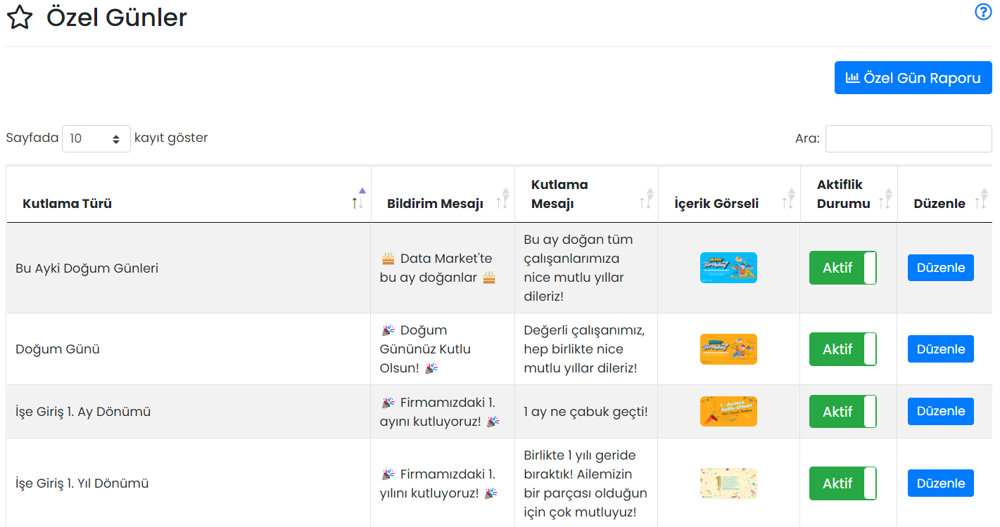
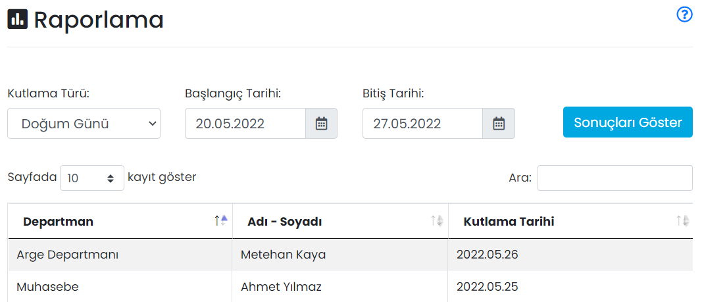

# :fontawesome-solid-user-gear: Özel Günler

Kullanıcı ve kullanıcı gruplarına doğum günü ve işe giriş yıl dönümlerinde kutlama bildirimleri otomatik olarak gönderilebilir. Bildirime tıklandığında bir görsel ve kutlama mesajı görüntülenir.

Öntanımlı 8 adet bildirim türü vardır. Tablo üzerindeki **Aktiflik Durumu** değiştirilerek ilgili bildirim açılıp kapatılabilir.

| 
Kutlama Türü
 | Açıklama                                                     |
| ------------------------------------------- | ------------------------------------------------------------ |
| Doğum Günü                                  | Her gün çalışır. Doğum Tarihi o gün olan kişilere bildirim ile kutlama mesajı yayınlanır. |
| Bu Ayki Doğum Günleri                       | Her ayın ilk günü çalışır. Doğum Tarihi o ay içerisinde olan kişilerin departman ve isimleri kutlama mesajlarının altında listelenir. Tüm şirket çalışanlarına bildirim  yayınlanır. Ayrıca bkz. [Mobil Yaka Uygulamasındaki Özel Günler Sayfası](#mobil-yaka-uygulamasindaki-ozel-gunler-sayfasi) |
| Yıl Dönümleri                               | [Mobil Yaka Uygulamasındaki Özel Günler Sayfasında](#mobil-yaka-uygulamasindaki-ozel-gunler-sayfasi) Yıl Dönümleri sekmesinde gösterilecek metin ve görseldir. Yıl dönümleri için bildirim yayınlanmaz.|
| İşe Giriş 1. Ay Dönümü                      | Her gün çalışır. İşe Giriş Tarihi'nden itibaren 1 ay geçmiş olan kişi(ler)in departman ve isimleri kutlama mesajının altında listelenir. Tüm şirket çalışanlarına bildirim  yayınlanır. |
| İşe Giriş 1. Yıl Dönümü                     | Her gün çalışır. İşe Giriş Tarihi'nden itibaren 1 yıl geçmiş olan kişi(ler)in departman ve isimleri kutlama mesajının altında listelenir. Tüm şirket çalışanlarına bildirim  yayınlanır. Aşağıdaki yıllar için de -yıllar farklı olmak üzere- aynı şekilde çalışır. |
| İşe Giriş 5. Yıl Dönümü                     | -                                                            |
| İşe Giriş 10. Yıl Dönümü                    | -                                                            |
| İşe Giriş 15. Yıl Dönümü                    | -                                                            |
| İşe Giriş 20. Yıl Dönümü                    | -                                                            |

!!! note "Not"

    Ay dönümü kutlaması için: Gün sayısı aya göre farklılık gösterdiğinden, işe girilen gün bir sonraki ayda yoksa, o ayın son günü kutlama mesajı yayınlanır. Örneğin; 30 Ocak'ta işe giren personel için 28 ya da 29 Şubat'ta kutlama mesajı yayınlanır.
    
    Yıl dönümü kutlamaları için: İşe giriş tarihi 29 Şubat ise, o yılki Şubat ayının son günü kutlama mesajı yayınlanır.

### Düzenle

İlgili özel gün bildiriminin düzenlenebileceği ekrandır.

| Özellik         | Açıklama                                                     |
| --------------- | ------------------------------------------------------------ |
| Kutlama Adı     | -                                                            |
| Bildirim Mesajı | Kutlamanın bildirim mesajıdır.                               |
| Kutlama Mesajı  | Kutlama açıldığında görüntülenecek mesajdır.                 |
| İçerik Görseli  | Kutlama açıldığında gösterilecek görseldir. Tavsiye edilen görsel boyutu: 1080 x 720 px (6:4 oran) |

## Yaklaşan Kutlamalar

15 gün içerisinde gerçekleşecek tüm kutlamaların listelendiği ekrandır.

## Özel Gün Raporu

Seçilen kutlama türü ve tarih aralığı için kutlama mesajına dahil edilen kişi bilgilerinin raporlanabileceği ekrandır.

## Mobil Yaka Uygulamasındaki Özel Günler Sayfası

Mobil uygulamanın sağ üst menüsünden ulaşılabilen Özel Günler sayfasında, çalışanların yaklaşan doğum günü ve iş yıl dönümleri listelenir.

Bu sayfada 2 sekme bulunur:

**Bu Ay Doğanlar:** Bulunduğumuz ay doğum günü olan çalışanlar alfabetik olarak listelenir. Tam doğum tarihinin görüntülenip görüntülenmemesi kullanıcıların insiyatifindedir. Varsayılan olarak tam doğum tarihi kapalı gelir.

**Yıl Dönümleri:** O gün iş yıl dönümü olan kullanıcılar, en uzun yıldan beri firmanızda olan çalışanlar başta olmak üzere listelenir.

Her iki sekmedeki görsel ve kısa kutlama metnini, paneldeki Özel Günler sayfasından **Bu Ayki Doğum Günleri** ve **Yıl Dönümleri** seçeneklerinden değiştirebilirsiniz.

??? info "Mobil Yaka Özel Günler"

    
