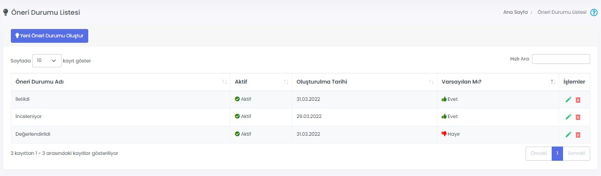

# :fontawesome-solid-clipboard-list: Öneri Durumu

Çalışanlarınızın önerileri değerlendirilirken farklı "durum"lar belirlenebilir. Bu durumlar sayesinde çalışanlar önerilerinin hangi aşamada olduğunu takip edebilirler.

## :fontawesome-solid-clipboard-list: Öneri Durum Listesi

"İletildi", "Değerlendiriliyor" ve "Değerlendirildi" durumları otomatik olarak oluşturulmuştur. **Yeni Öneri Durumu Oluştur** butonu ile yeni durumlar oluşturulabilir.

### Düzenle

İlgili durum adının ve aktiflik durumunun düzenlendiği ekrandır.

### Sil

İlgili kaydın silinmesini sağlar.

!!! warning "Uyarı"

    "Varsayılan" durum, bir Öneri oluşturulduğunda atanan durumdur. Bu sebeple silinemez ancak ismi değiştirilebilir.