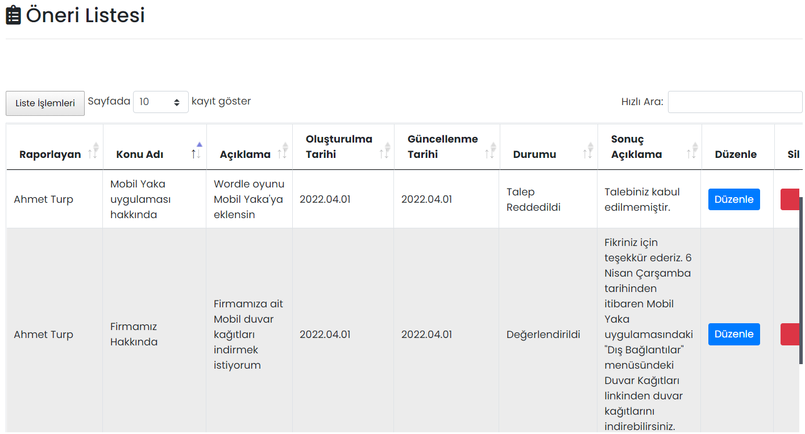

# :fontawesome-solid-clipboard-list: Öneri

Çalışanlarınız öneri ve şikayetlerini Öneri modülü ile paylaşabilirler. Paylaşılan önerileri değerlendirebilir ve çalışanlarınıza geri bildirimde bulunabilirsiniz.

## :fontawesome-solid-clipboard-list: Öneri Listesi

Mobil Yaka uygulamasından gönderilen öneriler burada gösterilir ya da silinir. Liste İşlemleri butonu ile Excel, PDF dosyası olarak kaydetme veya yazdırma işlemleri yapılabilir.

### Etkileşim Raporu

İlgili önerinin beğeni ve yorumlarının listelendiği ekrandır.

### Düzenle

Çalışanların önerilerin değerlendirildiği ekrandır. Gönderiyi düzenledikten sonra kaydettiğinizde, gönderi sahibine bildirimde bulunulur.

| Özellik              | Açıklama                                                     |
| -------------------- | ------------------------------------------------------------ |
| Raporlayan           | Öneriyi oluşturan Mobil Yaka kullanıcısı.                    |
| Konu Adı             | Öneri konusu.                                                |
| Açıklama             | Öneri açıklaması.                                            |
| Oluşturulma Tarihi   | -                                                            |
| İçerik Görseli       | Uygulama içerisinden 3 adede kadar görsel eklenebilir.       |
| Durumu               | Çalışanlarınızın önerileri değerlendirilirken farklı "durum"lar belirlenebilir. Bu durumlar sayesinde çalışanlar önerilerinin hangi aşamada olduğunu takip edebilirler. bkz. [Öneri Durumu](/yardim/anasayfa/oneriler/oneri-durumu/) |
| Sonuç Açıklama       | Önerinin değerlendirilmesi sonucunda yazılacak açıklamadır. Zorunlu değildir. |
| Kullanıcı Tercihleri | Öneriyi gönderen çalışanın gizlilik tercihleridir. Bu alanlarda değişiklik yapılamaz. **İsmim Paylaşılsın** seçili ise öneriyi paylaşanın ismi görünür, seçili değil ise "Anonim" olarak görünür. **Önerim Yayınlansın** seçili ise öneriyi paylaşan kişi, önerisinin herkese açık olmasına izin vermiştir ve isterseniz öneriyi diğer çalışanlar da görebilir. Seçili değil ise öneri sadece yönetim panelinden görülebilir, diğer kullanıcılar tarafından görüntülenemezler. |
| Herkese Yayınla      | İşaretlenmesi hâlinde öneri, Önerini Paylaş modülünde tüm kullanıcılar tarafından görünür. Bir öneri sadece "Önerim Yayınlansın" seçeneği işaretli ise herkese yayınlanabilir. (Bu seçenek "Düzenle" sayfasında sağ altta yer alır). Not: Önerilerin onay gerektirmeden otomatik olarak yayınlanması da mümkündür. bkz. [Öneri Direkt Yayınlansın Mı?](/yardim/anasayfa/firma-yonetimi/firma-bilgileri/#sirket-bilgileri) |

### Sil

İlgili kaydın silinmesini sağlar.

## Uygulama İçi Görünümü

??? info "Öneri Paylaşma"

    <iframe width="300" height="533" src="https://xd.adobe.com/embed/a51929be-b754-4dc0-ad0d-97be0156061d-f04a/screen/68f753d8-6a56-43ca-b208-67d83cfecee2" frameborder="0" ></iframe>
