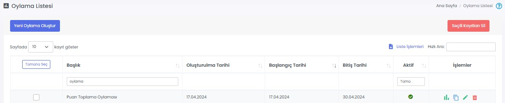

# :material-vote-outline: Oylamalar

Oylamalar modülü sayesinde çalışanlarınızın bir konu hakkındaki fikrini hızlıca alabilirsiniz.

Bir [oylama tanımladıktan](#oylama-tanimla) sonra ilgili oylama **Düzenle** butonu ile açılır ve [oylamaya soru eklenir](#yeni-soru-olustur).

## :fontawesome-solid-square-poll-vertical: Oylama Listesi
Oluşturulmuş oylamalar ve oylama raporları burada gösterilir, düzenlenir ya da silinir.

### Özet Rapor

İlgili oylamaya ait sonuçların görüntülenebileceği ekrandır. Rapor, Excel ve PDF formatında indirilebilir ya da yazdırılabilir.

### Oylama Kopyala

İlgili oylamanın bir kopyasını oluşturur.

### Düzenle

İlgili oylamanın düzenlenebileceği ekrandır. Sayfadaki özellikler için bkz: [Oylama Tanımla](#oylama-tanimla)

### Sil

İlgili oylamanın silinmesini sağlar.

## Yeni Oylama Oluştur

### Oylama Tanımla

Tüm kullanıcıların katılabileceği yeni bir oylama oluşturmak için kullanılır.

| Özellik                  | Açıklama                                                     |
| ------------------------ | ------------------------------------------------------------ |
| Bildirim Gönderme Durumu | Açık olması halinde; oylama yayımlandığı anda firmanızdaki tüm kişilere bildirim gönderilir. |
| Başlık                   | Oylama başlığı.                                              |
| Aktif                    | Aktif olması durumunda oylama görünür, Pasif olması durumunda görünmez. |
| Liste Görseli            | Oylama tamamlandığında, tamamlanan listesinde görünür. Tavsiye edilen görsel boyutu: 1080 x 1080 px (1:1 oran) |
| Galeri Görseli           | Oylama galerisinde gösterilecek görseldir. Tavsiye edilen görsel boyutu: 1080 x 720 px (3:2 oran) |
| Oylama Başlangıç Tarihi  | Oylama, seçilen tarihten sonra görünür olur. Yayımlanma tarihi geldiğinde -aktifleştirildiyse- kullanıcılara bildirim gider. |
| Oylama Bitiş Tarihi      | Oylama, seçilen tarihten sonra kapanır. Yayımlanma tarihi geldiğinde -aktifleştirildiyse- kullanıcılara bildirim gider. |

### Oylamayı Kaydetme ve Yayınlama

Yeni bir oylama oluşturduğunuzda **Taslağı Kaydet** butonu ile çalışmanızı kaydedebilirsiniz. Taslak olarak kaydedilmiş oylamalar henüz mobil uygulamadan erişilebilir olmayacaktır. Oylamaya soru eklemeyi tamamladıktan sonra oylamayı yayınlamak için **Yayınla** butonuna tıklayabilirsiniz. Bu durumda kullanıcılar mobil uygulamadan oylamaya erişebilirler.

!!! note "Not"

    Mobil Yaka uygulaması üzerinden oylamayı tamamlamış kullanıcı, oylamayı tamamladığını aynı penceredeki listeden görür.
    
    Kullanıcı oylamaya katılmadı ise oylama bitiş tarihi geldiğinde bu oylamayı bir daha göremez.
    
    Aktiflik durumu "Pasif" seçilirse oylama kullanıcılara tamamen görünmez hâle gelir.
    
    Herhangi bir sebeple oylamayı kaçıran kullanıcılarınız için tekrar aynı oylamayı oluşturmak yerine, oylama bitiş tarihini uzatabilirsiniz. Bu durumda oylamayı tamamlamış kullanıcılar için oylama tekrar açılmayacaktır.

## Oylama Düzenle

### Yeni Soru Oluştur

Bir oylamaya birden fazla soru eklenebilir.

| Özellik              | Açıklama                                                     |
| -------------------- | ------------------------------------------------------------ |
| Açıklama             | Soru metnidir.                                               |
| Aktif                | Aktif olması durumunda soru, oylama içerisinde görünür. Pasif olması durumunda görünmez. |
| Oylama Tipi Seçiniz  | Emoji, Rakam, Yıldız olarak oylama puanlanabilir.            |
| Cevap Metinleri      | Puanlama için 1-5 arası değerlerin metnidir.                 |

<figure markdown>     <figcaption>Oylama Tipleri</figcaption> </figure>

#### Listele

İlgili oylama sorusuna ait sonuçların görüntülenebileceği ekrandır. Rapor, Excel ve PDF formatında indirilebilir ya da yazdırılabilir.

#### Düzenle

İlgili sorunun düzenlenebileceği ekrandır. Sayfadaki özellikler için bkz: [Yeni Soru Oluştur](#yeni-soru-olustur)

!!! warning "Uyarı"

    Oylamayı tamamlamış en az 1 kullanıcı olması hâlinde;
    
    - Sorularda düzenleme yapılamaz.
    
    - Soru eklenebilir ancak oylamayı tamamlamış olanlar bu yeni soruları yanıtlayamazlar.

#### Sil

İlgili sorunun silinmesini sağlar.

## Uygulama İçi Görünümü

??? info "Oylama Listesi"

    <iframe width="300" height="533" src="https://xd.adobe.com/embed/a51929be-b754-4dc0-ad0d-97be0156061d-f04a/screen/bb0dbead-7b0a-48a7-93af-152fab2afe54" frameborder="0" ></iframe>