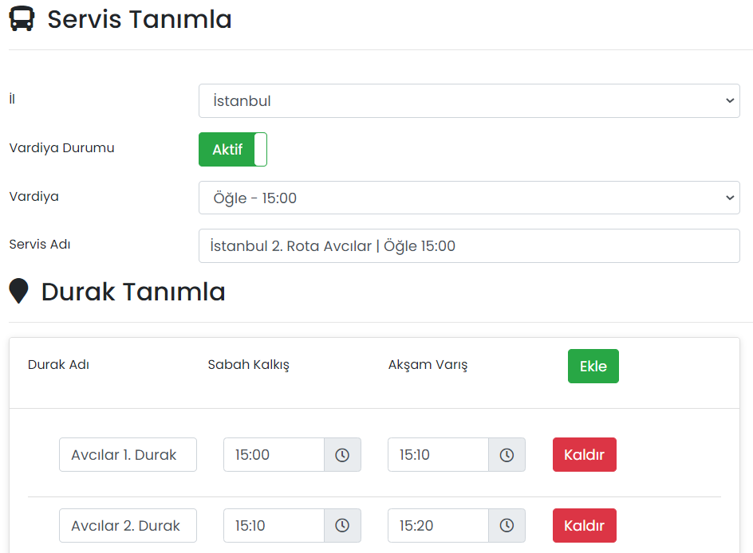

# :fontawesome-solid-bus: Servis Yönetimi

## :fontawesome-solid-bus: Servisler

Firmanızdaki servis bilgileri oluşturulur, düzenlenir ya da silinir.

### Düzenle

İlgili servisin düzenlenebileceği ekrandır. Sayfadaki özellikler için bkz: [Servis Tanımla](#servis-tanimla)

### Sil

İlgili servisin silinmesini sağlar.

## Yeni Servis Oluştur

### Servis Tanımla

Yeni bir servis tanımlayı sağlar.

{: style="height:439px"}

| Özellik        | Açıklama                                                     |
| -------------- | ------------------------------------------------------------ |
| İl             | Servisin hizmet verdiği il.                                  |
| Vardiya Durumu | Aktif olması durumunda bu servis için Vardiya bilgisi girilebilir. |
| Vardiya        | Servisin hangi vardiyaya ait olduğu seçilir. Vardiya tanımlamak için bkz. [Vardiya Tanımla](/yardim/anasayfa/servis-yonetimi/vardiyalar/#vardiya-tanmla) |
| Servis Adı     | -                                                            |

### Durak Tanımla

Servisin geçeceği duraklar ve sabah/akşam saatleri eklenir.

## Uygulama İçi Görünümü

??? info "Servis Güzergahları"

    <iframe width="300" height="533" src="https://xd.adobe.com/embed/a51929be-b754-4dc0-ad0d-97be0156061d-f04a/screen/9256540d-d3cf-45d3-bc95-b478dd2c14ad" frameborder="0" ></iframe>