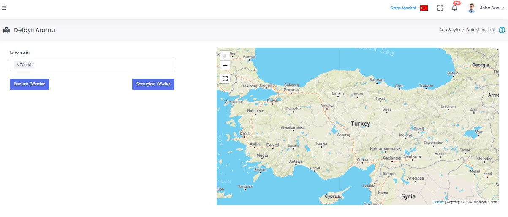

# :fontawesome-solid-bus: Servis Yönetimi

## :material-clock-time-four-outline: Detaylı Arama

Servis takibi yapılacak olan servisin adı seçilir ve Konum Gönder butonu kullanılarak seçilen servislerin konumu alınır. Sonuçları Göster butonu kullanılarak servislerin harita üzerinde konumları görüntülenebilir.

## Servis Takibi

Sonuçları Göster butonu ile harita üzerinde konumu gösterilen servislerin detayları aşağıdaki parametreler ile konumlandırılır

| Özellik                  | Açıklama                                                     |
| ------------------------ | ------------------------------------------------------------ |
| Servis Adı               | Servis Yönetimi ekranında kayıt edilen servisin adı.
| İl                       | Servisin kullanıldığı il.                                              |
| Vardiya Adı              | Servisin aktif olduğu vardiya. |
| Servis Şöförü            | Servis Şöförü adı. |
| Konum Saati         | Konum görüntülenme saati.|
| Koordinat  | Servisin konumuna ait koordinat. Bu koordinat'a tıklandığında Google Map üzerinden konuma erişilebilir |

