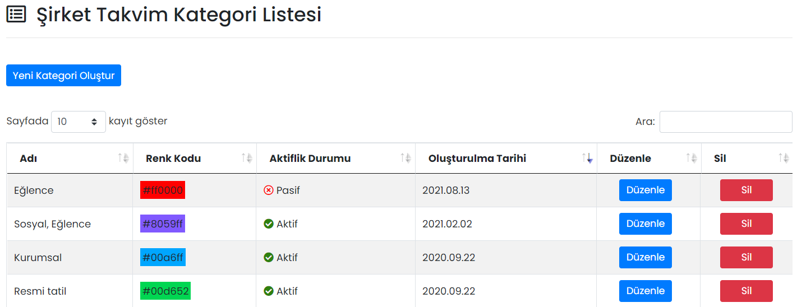

# :fontawesome-solid-list: Kategoriler

## :fontawesome-solid-list: Şirket Takvim Kategori Listesi

## Yeni Kategori Oluştur

### Kategori Tanımla

Takvimde görünecek etkinlikler için kategoriler tanımlanabilir. Kategorilere farklı renkler tanımlayabilirsiniz.

| Özellik                       | Açıklama                                                     |
| ----------------------------- | ------------------------------------------------------------ |
| Kategori Adı                  | -                                                            |
| Aktif                         | Aktif olması durumunda kategori, Etkinlik Kategorisi kısmında görünür, Pasif olması durumunda görünmez. |
| Renk Paletinden Seçim Yapınız | Kategorinin takvim üzerinde görüntülenecek rengi.            |

!!! note

    Aktiflik "Pasif" olması durumunda, ilgili kategori sadece yeni etkinlik tanımlanırken Etkinlik Kategorisi alanında görünmez. Pasife çekilmiş kategorideki etkinlikler Şirket Takvimi'nde görüntülenmeye devam edecektir.
