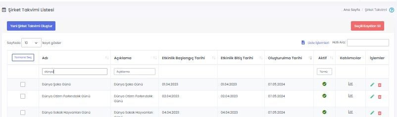

# :material-calendar-month: Şirket Takvimi

Şirket Takvimi'nde firmanıza ait etkinlikler, resmî tatiller ve geziler gibi önemli tarihler çalışanlarla paylaşılabilir.

## :material-calendar-month: Şirket Takvim Listesi

Oluşturulmuş etkinlikler burada gösterilir, düzenlenir ya da silinir. Etkinlik başlığına ve açıklamasına göre arama yapılabilir.

### Katılımcılar

[Katılım Bilgisi Alınsın](#katilim-bilgisi-alinsin) seçeneği işaretli olan etkinliklerin raporlarının göründüğü sayfadır.

### Düzenle

İlgili etkinliğin düzenlenebileceği ekrandır. Sayfadaki özellikler için bkz: [Şirket Takvimi Tanımla](#sirket-takvimi-tanimla)

### Sil

İlgili etkinliğin silinmesini sağlar.

## Yeni Şirket Takvimi Oluştur

### Şirket Takvimi Tanımla

Şirket Takvimi'ne yeni bir etkinlik girmek için kullanılır.

| Özellik                  | Açıklama                                                     |
| ------------------------ | ------------------------------------------------------------ |
| Bildirim Gönderme Durumu | Açık olması halinde; takvim yayımlandığı anda, alıcı listesinde seçilmiş kişilere bildirim gönderilir. |
| Etkinlik Adı             | -                                                            |
| Açıklama                 | -                                                            |
| Aktif                    | Aktif olması durumunda takvim görünür, Pasif olması durumunda görünmez. |
| Etkinlik Kategorisi      | Takvimin hangi kategoriye ait olduğunu belirtir. Kategoriler farklı renklere sahip olabilir. |
| Etkinlik Başlangıç Tarihi          | Etkinliğin hangi gün ve saatte başlayacağını belirtir.           |
| Etkinlik Bitiş Tarihi          | Etkinliğin hangi gün ve saatte biteceğini belirtir. Etkinlik Başlangıç ve Bitiş tarihi aynı olabilir. |
| Hatırlatıcı          | Etkinliği hatırlatma amaçlı otomatik olarak bildirim gönderilmesini sağlar. <ul><li>**Kapalı:** Etkinlik için bir hatırlatıcı gönderilmez.</li><li>**Etkinlik Gününde:** Etkinlik günü sabah saatlerinde kullanıcılara hatırlatıcı bildirim gider.</li><li>**Özel:** Hatırlatıcı bildirimin gideceği tarihin belirlenmesini sağlar. Seçilen tarihin sabah saatlerinde kullanıcılara bildirim gider.</li></ul><b>Not:</b> Hatırlatıcı, **Bildirim Gönderme Durumundan** bağımsızdır. Yani, bildirim gönderme durumu **Evet** seçildiğinde hatırlatıcı kapalı olsa bile, etkinlik oluşturulduğunda kullanıcılara bildirim gider. **Hayır** seçildiğinde, hatırlatıcı açıksa hatırlatıcı bildirim gider.          |
| Katılım Bilgisi Alınsın  | Aktif olması durumunda, çalışanlardan etkinlik için katılım bilgisi istenir. Etkinlik üzerinde "Katılım durumu bekleniyor" uyarısı görünür. Kullanıcılar etkinliği açtıktan sonra "Katılacağım, Katılmayacağım, Belli Değil" seçeneklerinden birisini seçerek geri bildirimde bulunabilirler.     "Not" alanına yazacağınız mesaj, kullanıcılara görünür ve kullanıcılar mesajınıza göre geri bildirimde bulunabilirler. Örneğin not olarak "Etkinliğe gelirken servis kullanacak mısınız?" yazabilirsiniz. Çalışanlar yanıtlarını belirteceklerdir. |

## Uygulama İçi Görünümü

??? info "Şirket Takvimi"

    <iframe width="300" height="533" src="https://xd.adobe.com/embed/a51929be-b754-4dc0-ad0d-97be0156061d-f04a/screen/2af16928-7785-48d7-a127-6c988fed3403" frameborder="0" ></iframe>
