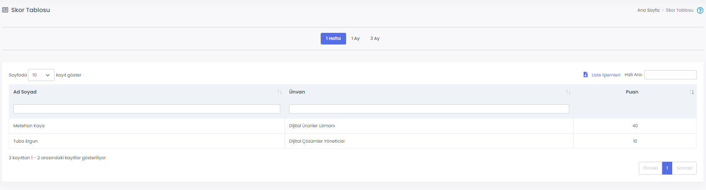
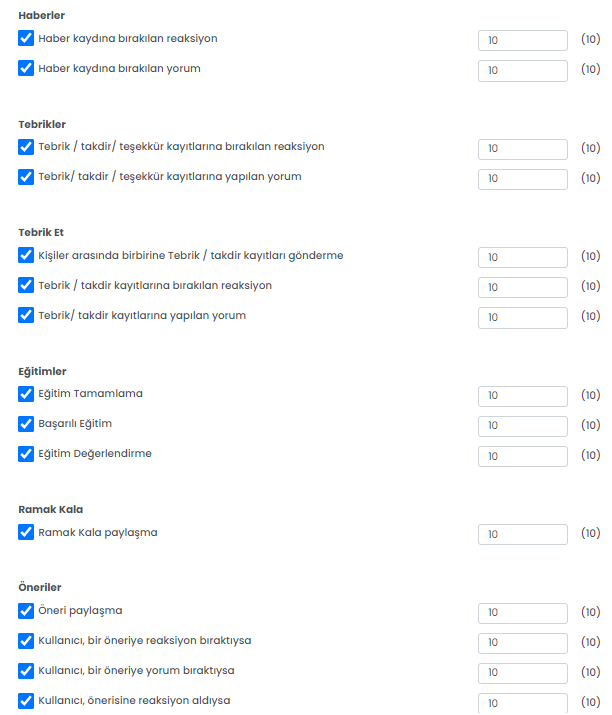
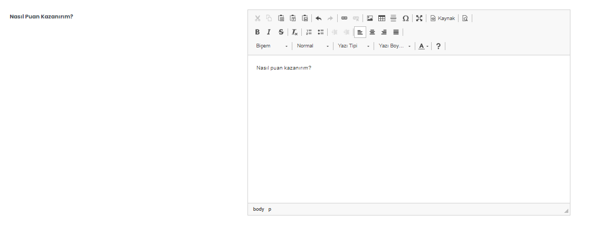

# :fontawesome-solid-user-lock: Skor Uygulaması

Kullanıcılar Mobil Yaka üzerindeki bazı uygulamalar üzerinden yaptıkları aksiyonlar sonrası puan kazanırlar. Kazandıkları puanlar toplanarak Skor Tablosu sayfasında kullanıcıların sıralaması ve puanları gösterilir. Böylelikle Mobil Yaka’yı aktif kullanma motivasyonu sağlanmış olur. 

## :fontawesome-regular-handshake: Skor Tablosu

Skor Tablosu sayfasında kullanıcıların uygulamada yapmış oldukları aksiyonlar sonucu kazandıkları puanlar ve kullanıcılar arası sıralamalar gösterilir. 

Bu sayfada kazanılan puanlar **HAFTALIK - AYLIK ve SON 3 AYLIK** olarak gösterilmesi sağlanır.

**Skor Tablosunda aşağıdaki alanlar gösterilir;**

Bu alanlar sayesinde filtreleme yapılarak, detaylar görüntülenir ve **Liste İşlemleri** ile Excel ve PDF olarak dosya indirilebilir ya da Kopyalanıp, kayıtlı olan yazıcıdan çıktı alınabilir.

**Adı Soyadı** : Skor alan çalışanın adı soyadı görüntülenir

**Ünvanı** Skor alan çalışanın şirket içerisinde Mobil Yaka'da kayıtlı bulunan ünvanı gösterilir

**Puan** Skor alan çalışanın seçilen filtre doğrultusunda aldığı puan gösterilir

## :fontawesome-regular-handshake: Puanlandırma

Skor Tablosunda aksiyonlara göre puan değerlerini belirleyebilirsiniz. Bir aksiyon için puan vermek istemiyorsanız ilgili aksiyonu pasif duruma getirebilirsiniz. Parantez içindeki sayılar, varsayılan değeri ifade eder.

## :fontawesome-regular-handshake: Nasıl Puan Kazanırım

Çalışanlarınızın nasıl puan kazanacaklarına ait uygulama üzerindeki bildiriminizi güncelleyebileceğiniz sayfadır.

Uygulama İçi Görünümü
??? info "Nasıl Puan Kazanırım"

    <iframe width="300" height="533" src="https://xd.adobe.com/embed/9a75261c-7051-4c5a-b406-3a1c1a760843-cf26/screen/ceefb207-015a-46e8-bf78-937429f194fa/" frameborder="0" ></iframe>

### Skor içerisinde bulunan uygulamalar

Mobil Yaka içerisinde bulunan uygulamaları kendi firmanız özelinde aktif/pasif hale getirerek skor uygulaması içerisinde kullanabilirsiniz.

Aşağıdaki uygulama Skor uygulaması içerisinde aktif olarak bulunmaktadır.

| Özellik                  | Açıklama                                                     |
| ------------------------ | ------------------------------------------------------------ |
| Haberler                 | Yayınlanan Haber içeriğine yorum yapılması ya da reaksiyon verilmesi durumunda çalışanlar puan kazanabilir|
| Tebrik Et                  | Çalışanların birbirlerine gönderdiği Tebrik ve Takdir'lere ve bu durumlara reaksiyon bırakılmasına göre puan kazanılabilir.            |
| Eğitimler             | Eğitimlerin tamamlanma, başarılı olma ya da eğitimi değerlendirme durumuna göre çalışanlar puan kazanabilir.|
| Ramak Kala                | Ramak Kala gönderimi yapıldığında çalışanlar puan kazanabilir.                                     |
| Öneri                   | Öneri gönderilmesi, gönderilen öneriye reaksiyon yorum bıraktıysa ya da gönderisine reaksiyon alması durumunda çalışanlar puan kazanabilir.|

Uygulama İçi Görünümü
??? info "Uygulama Görüntüsü Ana Sayfa"

    <iframe width="300" height="533" src="https://xd.adobe.com/embed/9a75261c-7051-4c5a-b406-3a1c1a760843-cf26/screen/0e576568-01df-4fe8-b9fe-6261067fa6e6/" frameborder="0" ></iframe>

??? info "Skor Tablo Görüntüsü"

    <iframe width="300" height="533" src="https://xd.adobe.com/embed/9a75261c-7051-4c5a-b406-3a1c1a760843-cf26/screen/2284b304-7b51-47c3-85e3-0da46a2e9739/" frameborder="0" ></iframe>