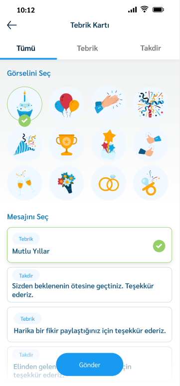
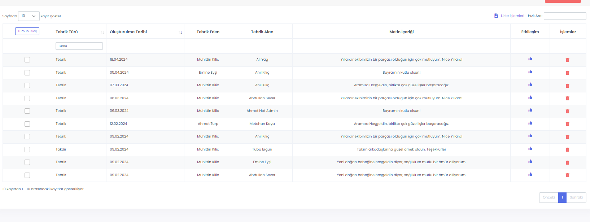
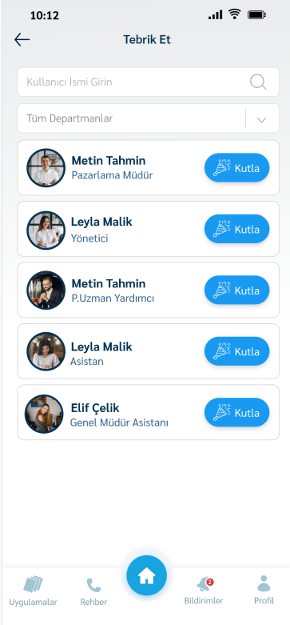

# :fontawesome-solid-user-lock: Tebrik Et Uygulaması

Bu uygulama ile kullanıcıların etkileşimini ve birbirini takdir etme kültürünün çoğalması sağlanmaktadır..

Kullanıcıların yolladığı özel gün ve tebrik mesajlarının sistemde bir puanlaması olup ay ve yıllık ödüllendirilme amaçlanmıştır.

Yöneticiler haricinde de kullanıcıların birbirleri arasında etkileşimini arttırmak ve kullanıcıların bu birbiriyleriyle iletişim sayesinde ödüllendirilme sistemini kurum kültürüne oturtmak bu uygulama ile mümkündür.

??? info "Uygulama Kullanımı"

Uygulamayı 2 farklı noktadan kullanabilirsiniz.

* Kişilerin adlarının yanına bir ‘Kutla’ ikonu ya da kartı üzerinden kullanım.
* Ana Sayfa üzerinde " Tebrik Et " Butonu üzerinden kullanım

Uygulamada tarafından hazır olan kartlar bulunur. Gerekirse yönetim panelindende eklenmesi için düzenlemeler yapabilir. Mesaj yazma sayfasında arkaplanı, seçilen ikona veya özel güne göre renkli ikonlar ile özel hazır mesajlar seçilerek çalışana gönderim yapılır

??? info "Tebrik Et Raporları"

Panel üzerinde kullanıcıların birbirine gönderdiği tebrik bilgileri bulunan bir raporlama sayfası bulunmaktadır.

Burada çalışanların Tebrik Türü, Tebrik Alan, Metin içeriği gibi parametrelerle gönderdikleri tebrik süreçlerini izleyebilirsiniz.

??? info "Tebrik Et Application Görüntüleri"

