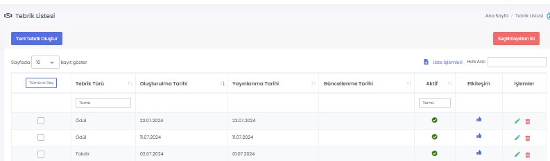

# :fontawesome-regular-handshake: Tebrikler
Firma çalışanlarının isimlerine ya da departmanlarına özel tebrik, takdir ve ödüller oluşturabilirsiniz.

## :fontawesome-regular-handshake: Tebrik Listesi

Oluşturulmuş tebrikler burada gösterilir, düzenlenir ya da silinir.

### Etkileşim Raporu

İlgili tebriğin beğeni ve yorumlarının listelendiği ekrandır.

### Tebrik Düzenle

İlgili tebriğin düzenlenebileceği ekrandır. Sayfadaki özellikler için bkz: [Tebrik Tanımla](#tebrik-tanimla)

### Tebrik Sil

İlgili tebriğin silinmesini sağlar.

## Tebrik Oluştur

### Tebrik Tanımla

| Özellik                  | Açıklama                                                     |
| ------------------------ | ------------------------------------------------------------ |
| Bildirim Gönderme Durumu | Açık olması halinde; haber yayımlandığı anda, alıcı listesinde seçilmiş kişilere bildirim gönderilir. |
| Şablon                   | Önceden hazırlanmış şablonlardan seçim yapılır.              |
| Tebrik Türü              | Ne tür tebrik yapılacağıdır. Tebrik türüne göre ikonlar değişir. |
| Açıklama                 | Tebriğin açıklamasıdır.                                      |
| Aktif                    | Aktif olması durumunda tebrik görünür, Pasif olması durumunda görünmez. |
| Rozet                    | Tebrik listesinde gösterilecek görseldir. Tavsiye edilen görsel boyutu: 1080 x 432 px (5:2 oran) |
| Detay Görseli            | Tebrik açıldığında gösterilecek görseldir. 5 adede kadar görsel eklenebilir. Tavsiye edilen görsel boyutu: 1080 x 540 px (2:1 oran) |
| Yayınlanma Tarihi        | Tebrik, seçilen tarihten sonra görünür olur. Yayınlanma tarihi geldiğinde -aktifleştirildiyse- kullanıcılara bildirim gider. |

### Tebrik Edilecek Kişiler

Tebrik edilecek kullanıcıların ya da kullanıcı gruplarının seçildiği alandır. Kullanıcı ya da gruplar ismine göre aranabilir. **Kaydet ve gönder** butonu tıklandığında -aktifleştirildiyse- seçili alıcılara bildirim gider. Girilen tebrikler Mobil Yaka kullanan tüm kullanıcılar tarafından görünür.

### Tebrik Edilen Kişiler

Hangi kullanıcıların tebrik edildiğinin listesidir.

!!! note "Not"

    Seçilen kişiler, tebrik mesajında ismi ve ünvanı görünecek şekilde ayrı ayrı listelenir. Grubu seçmeniz halinde gruptaki kişilerin isimleri görünmez, bulunduğu grup tebrik edilir.

## Uygulama İçi Görünümü

??? info "Tebrik Listesi"

    <iframe width="300" height="533" src="https://xd.adobe.com/embed/a51929be-b754-4dc0-ad0d-97be0156061d-f04a/screen/fa7f5876-a790-4627-bcdb-5d5c59f642a1" frameborder="0" ></iframe>
