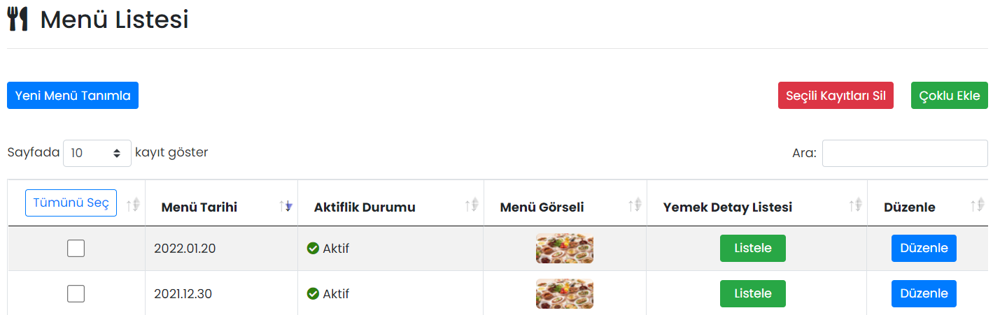
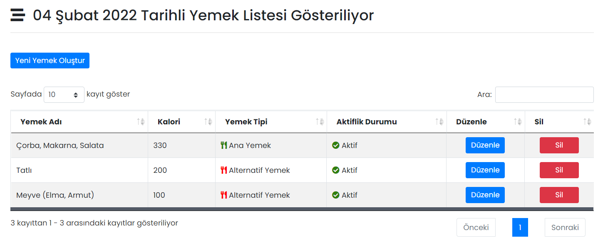

# :fontawesome-solid-utensils: Yemekler

Firmanızın yemekhane menüsünü listeleyebilirsiniz. Excel listesi kullanarak tek seferde birden fazla gün için menü girilebilir.

## :fontawesome-solid-utensils: Menü Listesi

Oluşturulmuş menüler burada gösterilir, düzenlenir ya da silinir.

### Listele

Menüdeki yemek listesini görüntüler.

### Düzenle

İlgili menüye ait yemeklerin düzenlenebileceği ekrandır. Sayfadaki özellikler için bkz: [Menü Tanımla](#menu-tanimla)

### Seçili Kayıtları Sil

Menü listesinden seçilmiş kayıtların silinmesini sağlar.

## Yeni Menü Tanımla

### Menü Tanımla

Yeni bir menü oluşturmak için kullanılır.

Bir menü oluşturulduktan sonra ilgili menü "Düzenle" butonu ile açılır ve [menüye yemek eklenir](#yeni-yemek-olustur).

| Özellik              | Açıklama                                                     |
| -------------------- | ------------------------------------------------------------ |
| Menü Tarihi          | Menünün servis edileceği tarihtir.                           |
| Aktif                | Aktif olması durumunda menü görünür, Pasif olması durumunda görünmez. |
| Menü Görseli         | Tavsiye edilen görsel boyutu: 1080 x 540 px (2:1 oran)       |

## Menü Güncelle

### Yeni Yemek Oluştur

| Özellik              | Açıklama                                                     |
| -------------------- | ------------------------------------------------------------ |
| Yemek Adı            | -                                                            |
| Kalori               | -                                                            |
| Aktif                | Aktif olması durumunda yemek görünür. Pasif olması durumunda görünmez. |
| Ana Yemek Durumu     | "Hayır" seçilmesi durumunda, eklenen yemek "Alternatif Yemek" olarak görünecektir. |

### Çoklu Ekle

Bir Excel dosyası ile, tek seferde sisteme birden çok menü eklemek için kullanılır.

## Uygulama İçi Görünümü

??? info "Yemekler"

    <iframe width="300" height="533" src="https://xd.adobe.com/embed/a51929be-b754-4dc0-ad0d-97be0156061d-f04a/screen/f8e5fb9f-971c-411a-b5fa-afa4cf541dc4" frameborder="0" ></iframe>