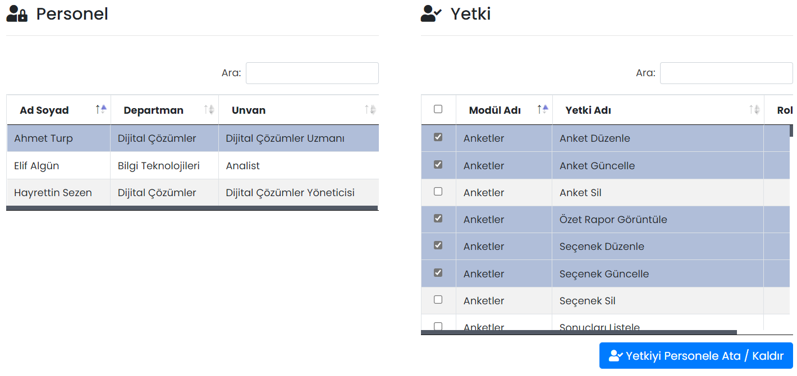
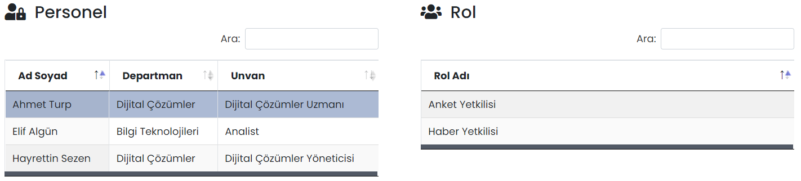

# :fontawesome-solid-user-lock: Personeller

Yetkilendirme, Mobil Yaka yönetim paneline yetkisi olan kullanıcıların, modüller üzerindeki yetkilerinin kontrolünü sağlar. Yönetim panelinde ilgili yetkisi olmayan personel, ilgili modülü göremez ve/veya değişiklik yapamaz. Grup ve kullanıcı bazlı yetkilendirme yapılabilir.

??? info "Personel, yetki ve rol tanımı"

    <b>Personel:</b> Mobil Yaka yönetim paneli yetkisi olan kullanıcılardır. Kullanıcıya yönetim paneli yetkisi [kullanıcı tanımlarken](https://yardim.mobilyaka.com/kullanicilar/kullanicilar/#kullanc-tanmla) (veya kullanıcıyı düzenleyerek) verilir.
    
    <b>Yetki:</b> Personellerin, modüller içerisinde içerik oluşturma, düzenleme, görüntüleme ve silme gibi alabileceği aksiyonlardır.
    
    <b>Rol:</b> Rollere yetkiler ve personeller tanımlanır.

Personeller sayfası, [Personel - Yetki](#personel-yetki) ve [Personel - Rol](#personel-rol) olarak ikiye ayrılmıştır.

## Personel - Yetki

Kullanıcı bazlı yetkilendirme bu sayfadan yapılır.

Bir personel ismine tıklandığında, personelin sahip olacağı yetkiler sağ taraftaki **Yetki** tablosundan tanımlanır. **Yetkiyi Personele Ata / Kaldır** butonu ile rolde yapılan değişiklikler kaydedilir.

## Personel - Rol

Bir personel ismine tıklandığında, personelin atandığı roller sağ taraftaki **Rol** tablosunda görüntülenir. Bu alanda bir değişiklik yapılamaz, bilgi amaçlıdır.

!!! tip "İpucu"

    Yönetim panelindeki yetkilendirmelerin kullanıcı bazlı tanımlanması (Personel - Yetki) yerine, grup bazlı tanımlanmasını (Rol - Yetki) tavsiye ederiz. Grup bazlı yetkilendirmelerin yönetimi (grupta bir kullanıcı bile olsa), kullanıcılara tek tek yetki vermekten çok daha kolaydır.