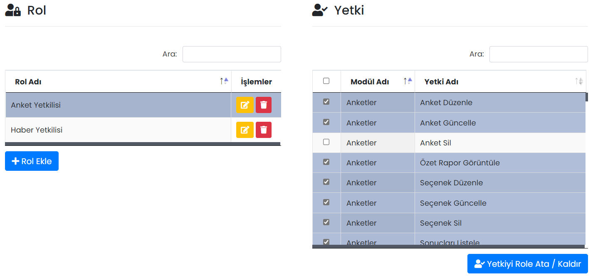
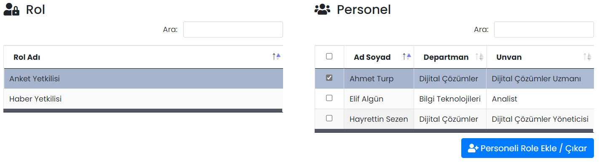

# :fontawesome-solid-user-lock: Roller

Yetkilendirme, Mobil Yaka yönetim paneline yetkisi olan kullanıcıların, modüller üzerindeki yetkilerinin kontrolünü sağlar. Yönetim panelinde ilgili yetkisi olmayan personel, ilgili modülü göremez ve/veya değişiklik yapamaz. Grup ve kullanıcı bazlı yetkilendirme yapılabilir.

??? info "Personel, yetki ve rol tanımı"

    <b>Personel:</b> Mobil Yaka yönetim paneli yetkisi olan kullanıcılardır. Kullanıcıya yönetim paneli yetkisi [kullanıcı tanımlarken](https://yardim.mobilyaka.com/kullanicilar/kullanicilar/#kullanc-tanmla) (veya kullanıcıyı düzenleyerek) verilir.
    
    <b>Yetki:</b> Personellerin, modüller içerisinde içerik oluşturma, düzenleme, görüntüleme ve silme gibi alabileceği aksiyonlardır.
    
    <b>Rol:</b> Rollere yetkiler ve personeller tanımlanır.

Roller sayfası, [Rol - Yetki](#rol-yetki) ve [Rol - Personel](#rol-personel) olarak ikiye ayrılmıştır.

## Rol - Yetki

Grup bazlı yetkilendirme bu sayfadan yapılır.

**Rol Ekle** butonu ile yeni bir rol oluşturulur. Bir role tıklandığında, rolün sahip olacağı yetkiler sağ taraftaki **Yetki** tablosundan tanımlanır. **Yetkiyi Role Ata / Kaldır** butonu ile rolde yapılan değişiklikler kaydedilir.

## Rol - Personel

Bir role tıklandığında, role sahip olacak personeller sağ taraftaki **Personel** tablosundan tanımlanır. **Personeli Role Ekle / Çıkar** butonu ile yapılan değişiklikler kaydedilir.

