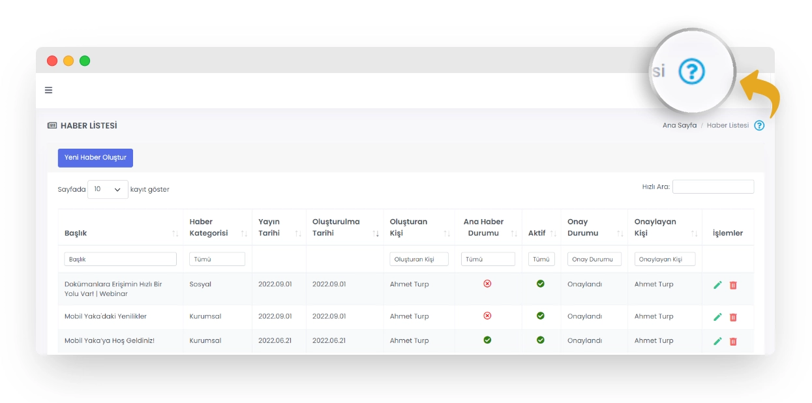
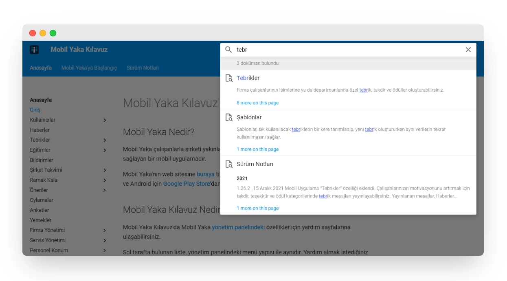

# Mobil Yaka Kılavuz'a Hoşgeldiniz.

## Mobil Yaka Nedir?

Mobil Yaka çalışanlarla şirketi yakınlaştıran ve her zaman her yerde etkileşim içinde olmalarını sağlayan bir mobil uygulamadır.

Mobil Yaka'nın web sitesine <a href="https://mobilyaka.com/" target="_blank">buraya</a> tıklayarak ulaşabilirsiniz. Mobil uygulamayı iOS için <a href="https://apps.apple.com/tr/app/mobil-yaka/id1532713247" target="_blank">AppStore</a> ve Android için <a href="https://play.google.com/store/apps/details?id=com.datamarket.dijitalyaka" target="_blank">Google Play Store</a>'dan indirebilirsiniz.

## Mobil Yaka Kılavuz Nedir?

Mobil Yaka Kılavuz'da Mobil Yaka <a href="https://panel.mobilyaka.com/" target="_blank">yönetim panelindeki</a> özellikler için yardım sayfalarına ulaşabilirsiniz.

Sol tarafta bulunan liste, yönetim panelindeki menü yapısı ile aynıdır. Yardım almak istediğiniz sayfanın ismine tıklayabilirsiniz.

Ayrıca, yönetim panelinin sağ üstünde bulunan "?" ikonuna tıkladığınızda ilgili sayfanın yardımına yönlendirilirsiniz.

Sağ üst tarafta bulunan **arama motoru** ile tüm sitede arama yapabilirsiniz.

Her yardım sayfasının en altında **Uygulama İçi Görünümü** (Mockup) bulunmaktadır. Bu interaktif resimler sayesinde ilgili modülün ekranlarını gezebilirsiniz.

!!! info "Not"

    Web tarayıcınızın güvenlik seviyesi "Yüksek" ise bu ekran görüntüleri açılmayabilir. Bu durumda tarayıcı güvenlik ayarlarınızı "normal" seviyeye çekebilir, ya da görüntüyü yeni sekmede açmak için <a href="https://xd.adobe.com/view/a51929be-b754-4dc0-ad0d-97be0156061d-f04a/" target="_blank">buraya</a> tıklayabilirsiniz.
    
    Bu görünümler tamamen mobil uygulamanın tasarımı hakkında bilgi verme amaçlı olup, mobil cihazınızdaki deneyimi birebir yansıtmamaktadır.
