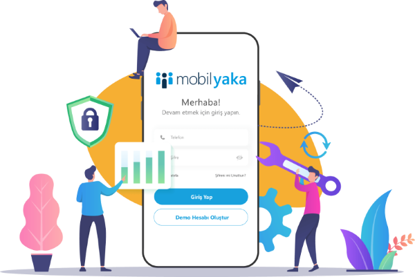

# Sürüm Notları

  

## Mobil Yaka Sürüm Notları

### 2024

???+ abstract "5 Kasım 2024"

    - Servis Takibi uygulaması eklendi.
    - Kullanıcı grupları sekmesinde bulunan kişiler ile ilgili rapor eklendi.
    - Organizasyon Şeması üzerinde iyileştirme çalışmaları yapıldı.

???+ abstract "1 Ekim 2024"

    - Organizasyon Şeması uygulaması eklendi.
    - Fotoğraf galerisinde fotoğraf ekleme ve galeri oluşturma adedi arttırıldı.
    - Kullanıcıların izin bakiyesinin gösterilmesi ile ilgili altyapı oluşturuldu.
    - Skor tablosu ve Haberler sayfasındaki uyarı metinleri düzenlendi.

???+ abstract "1 Eylül 2024"

    - QR Kodu ile Kişi Kartı Paylaşma yeteneği eklendi.
    - Haberlerde paylaşılan fotoğrafları yakınlaştırma özelliği eklendi.
    - Yemek menüsünde diğer ayların da görüntülenebilmesi seçeneği eklendi.

???+ abstract "19 Ağustos 2024"

    - Sorusu olmayan eğitimlerin yayınlama sorunu giderildi.
    - Uygulama açıldıktan sonra dil değiştirme özelliği eklendi.
    

???+ abstract "12 Ağustos 2024"

    - Kullanıcıların iletişim bilgilerinin kısıtlı olarak gösterimi geliştirmesi yapıldı

???+ abstract "12 Temmuz 2024"

    - Eğitim puanlama sorunu giderildi.
    - Uygulama içerisinde paylaşılam dosyaların ön gösterim yapılabilmesi sağlandı.

???+ abstract "1 Temmuz 2024"

    - Anket, Oylama ve Eğitim modüllerinde geliştirmeler yapıldı.
    - Servis modülünde durak kısmı düzenlemeleri yapıldı.
    - Anket ve Eğitim değerlendirme testlerinde karakter sınırı arttırıldı.
    - Eğitimlerde ders öncesi ve sonrası testlerde soru düzeltme sorunu giderildi.

???+ abstract "27 Mayıs 2024"

    - Yurtdışı Telefon Numaralarını Destekleme
    - Anket ve Eğitim değerlendirme testlerinde karakter sınırı arttırıldı.

???+ abstract "13 Mayıs 2024"

    - Anket oluşturma iyileştirilmesi yapıldı
    - Firma sayfasında eksik bilgiler ile ilgili pop-up eklendi.
    - Web sayfasını kullanan kullanıcıların raporları eklendi.
    - Aylık yemek sisteminde düzenlemeler yapıldı.
    - Eğitimlerde dosya yükleme sürecinde boyut sorunu giderildi.

???+ abstract "29 Nisan 2024"

    - Skor Uygulaması Eklendi
    - Haberler'e yayınlama süresi eklendi
    - Haberler'e görsel büyütme yeteneği eklendi
    - Kullanıcı panelinde tarih yapısı düzenlendi

???+ abstract "02 Nisan 2024"

    - Yapay Zeka içerik oluşturucu eklendi
    - Karekod ile içerik paylaşımı aktif hale getirildi.
    - Birden fazla dilde içerik yayınlama aktif hale getirildi
    - Ben Buradayım uygulaması aktif hale getirildi
    - Yemek Excel Şablonu Güncellendi
    - Tebrik Et modülünün panelde raporlanabilmesi geliştirmesi yapıldı

???+ abstract "16 Şubat 2024"

    - Takdir ve Tebrik Uygulaması Güncellendi
    - Web Erişimi aktif hale getirildi
    - Eğitim uygulamasında arama ve sonuç yapısı ile ilgili geliştirmeler yapıldı.
    - Güvenlik kontrolü ile ilgili geliştirmeler yapıldı. 

???+ abstract "15 Ocak 2024"

    - Yemek Listesinde menüler tüm ayı kapsayacak şekilde haftalık görüntülenebilir.
    - Kampanyalar için bildirimler iyileştirildi.
    - Haberlerde zengin metin içeriğinden kaynaklanan hatalar giderildi. 

??? abstract "02 Ocak 2024"

    - Çoklu dil desteği eklendi.
    - Ramak Kala’dan iletilen gönderilerde “İşlemde”, “Yanıt Bekleniyor”, “Çözüldü” gibi durumlar belirleyerek, çalışanlarınızın süreç takibini kolaylaştırabilirsiniz.
    - Soru grubu bulunan anketler için Açık Uçlu cevap seçeneği kullanılabilir.
    - Mobil uygulama arayüzünde çeşitli iyileştirmeler yapıldı.

### 2023

??? abstract "06 Kasım 2023"

    **👍 Reaksiyon ve Yorumlar**

    

    Haber, Tebrik ve Öneri içeriklerine duygusal tepkilerinizi paylaşabileceğiniz yeni <strong>ifade simgeleri</strong> ekledik. Beğen, Harika, Eğlenceli, İnanılmaz ve Tebrikler anlamına gelen özel tasarımlı ifadeleri beğeneceğinizi umuyoruz.

    Fikirlerinizi paylaşmanın tek yolu ifadeler değil! Artık Haber ve Önerilere <strong>yorumlarınızı</strong> da yazabilirsiniz. Kendi düşüncelerinizi ve görüşlerinizi paylaşarak içeriklere katkıda bulunabilirsiniz.

    📝 Kullanıcıların bıraktıkları ifade ve yorumlara Yönetim Panelinde ilgili içeriğin raporlarından ulaşabilirsiniz.

    **⚙️ Diğer Geliştirmeler**

    - Silinen bazı kullanıcıların uygulamaya erişme sorunu çözüldü.
    - Görsel eklemeden paylaşılan önerilerde alınan hata giderildi.
    - Android cihazlarda galeriden fotoğraf eklemeyi engelleyen bir hata çözüldü.

??? abstract "03 Ekim 2023"

    - Yönetim Panelinde birden fazla Mobil Yaka hesabınız varsa (örneğin alt firmalarınız), aralarında geçiş yapmak artık daha kolay. Sağ üstte bulunan profil fotoğrafınıza tıkladıktan sonra **Firma Değiştir** seçeneğine tıklayın. Açılan listeden geçiş yapmak istediğiniz firmayı seçip, o firmaya ait şifrenizi yazdıktan sonra diğer firmaya geçiş yapabilirsiniz.
    - Çalışanlarınızın bir testi kaç defa tekrar alabileceğini belirleyebilirsiniz. Test oluştururken **Başarısız Kullanıcılar Testi Tekrar Çözebilsin** seçeneğini açmanız yeterli.
    - Eğitim raporlarına Departman sütunu eklendi.
    - Haberlerin bazen 2 defa yayınlanmasına sebep olan bir hata düzeltildi.

??? abstract "14 Ağustos 2023"

    **Özel Günler sayfası eklendi**

    

    Çalışanlarınızın yaklaşan doğum günü ve iş yıl dönümlerinin listelendiği <strong>Özel Günler</strong> sayfasını ekledik.

    Özel Günler sayfası 2 sekmeden oluşuyor:

    <strong>Bu Ay Doğanlar:</strong> Bulunduğumuz ay doğum günü olan çalışanlar alfabetik olarak listelenir. Tam doğum tarihinin görüntülenip görüntülenmemesi kullanıcıların inisiyatifindedir. Varsayılan olarak tam doğum tarihi kapalı gelir.

    <strong>Yıl Dönümleri:</strong> O gün iş yıl dönümü olan kullanıcılar, en uzun yıldan beri firmanızda olan çalışanlar başta olmak üzere listelenir.

    Her iki sekmedeki görsel ve kısa kutlama metnini, paneldeki [Özel Günler](https://panel.mobilyaka.com/Anniversaries/List) sayfasından değiştirebilirsiniz.

??? abstract "2.9.5 <small>\_04 Ağustos 2023</small>"

    **Açık Pozisyonları Çalışanlarınızla Paylaşın**

    

    Yeni eklediğimiz <strong>Açık Pozisyonlar</strong> özelliği ile, kurumunuzdaki açık pozisyonları (iş ilanlarını) çalışanlarınıza duyurabilirsiniz. Çalışanlarınız boş pozisyonlardan haberdar olur ve pozisyona uygun olduğunu düşündükleri kişilerle <strong>ilanı kolayca paylaşabilirler</strong>. Bu sayede kurum içi işe alımı teşvik eder ve çalışan referanslarından faydalanabilirsiniz.

??? abstract "2.9.4 <small>\_26 Temmuz 2023</small>"

    **✔️ Kişi Kartları**

    

    Kurum içi etkileşimi artırmaya yönelik geliştirmeler yapmaya devam ediyoruz. Bunun için Profil ve Rehber sayfalarını baştan tasarladık ve yeni özellikler ekledik. <strong>Çalışanlar, profillerinde uzmanlık alanları ve hobilerini paylaşabilecekler</strong>.

    - Uzmanlık alanları bilgileri sayesinde bir çalışan, ihtiyaç duyduğu yetkinliğe sahip kişileri kolayca bulabilecek.
    - Hobilerin paylaşılması ise kişilerin, kendisiyle benzer hobilere sahip arkadaşlarını bulmasını veya başlamayı düşündüğü ancak daha fazla bilgi sahibi olmak istediği bir hobiye sahip olan iş arkadaşını bulmasını kolaylaştıracak.

    Çalışanlar, Mobil Yaka uygulamasından kendi uzmanlık alanlarını ve hobilerini ekleyebilir ve düzenleyebilirler. Yönetim Panelinden de aynı değişiklikler yapılabilir.

    Ayrıca, Rehber’den bir kullanıcı ismine tıklandığında, bu kullanıcının bilgilerini içeren kişi kartı açılacak.

    **📊 Haber Görüntülenme Raporu**

    Haberler ile ilgili görüntülenme istatistiklerinin sunulduğu <strong>Haber Görüntülenme Raporunu</strong> ekledik. Bu rapor sayesinde aşağıdaki bilgilere erişebilirsiniz:

    - Haberin toplam kaç defa okunduğu
    - Haberi görüntüleyen kullanıcı listesi
    - Haberi henüz görüntülememiş kullanıcı listesi

    **⚙️ Diğer Geliştirmeler**

    - Rehberdeki kullanıcı fotoğraflarının yüklenme hızı optimize edildi.
    - Mobil uygulamaya gönderilen bildirimlerin bir kısmı kırpılıyordu. Artık daha uzun bildirimler gösteriliyor.
    - Mobil uygulamada hangi bildirimlerin okunduğunun ve okunmadığının anlaşılması için görsel iyileştirme yapıldı.

??? abstract "2.9.3.2 <small>\_23 Haziran 2023</small>"

    **✔️ Hazır Eğitim, Anket ve Oylama İçerikleri**

    Çalışanlarınızla hızlı ve kolayca paylaşabileceğiniz **önceden tanımlı eğitim, anket ve oylama içerikleri** hazırladık. Kariyer gelişimi, iş yeri memnuniyeti, iletişim ve sürdürülebilirlik gibi kategorilerin yanı sıra bazı eğlenceli içerikler de bulacaksınız.

    Hazır içerikleri çalışanlarınızla paylaşmak çok kolay. Örneğin bir anket yayınlamak istiyorsanız:

    - Yönetim panelindeki Anketler / Hazır Anket İçerikleri sayfalasından hazır anketlere göz atın.
    - Paylaşmak istediğiniz içeriği işaretledikten sonra “Seçili Kayıtları Aktar” butonuna tıklamanız yeterli.

    Seçili anketler, firmanızın Anket Listesine aktarılır. Aktarımı yaptıktan sonra isterseniz direkt olarak, isterseniz de üzerinde değişiklik yaptıktan sonra ilgili anketi çalışanlarınıza yayınlayabilirsiniz. Aynı işlemleri Eğitimler ve Oylamalar için de yapabilirsiniz.

    **🔔 Yönetim Paneli Bildirimleri**

    Siz yokken Mobil Yaka’da neler oluyor? Artık bu sorunun cevabını size **Bildirimler penceresi** verecek. Aşağıdaki durumlarda bildirimler alacaksınız:

    -	Yeni bir Öneri veya Ramak Kala gönderisi paylaşıldığında,
    -	Onay gerektiren yeni bir Haber girildiğinde,
    -	Mobil Yaka firması olarak sizlere toplu duyuru paylaştığımızda.

    **🗳️ Anketler İçin Yeni Cevap Seçenekleri**

    Kullanıcıların, anket sorularında önceden belirlediğiniz seçenekler haricinde kendi cevaplarını yazabilmeleri için “**Diğer**” seçeneğini de cevap seçeneği olarak ekleyebilirsiniz.

    Çoklu Seçim soru tipinde, kullanıcıların seçebileceği cevap adedini sınırlayabilirsiniz.

    📝 Bu iki yeni özelliği nasıl kullanacağınızı öğrenmek için yardım sayfasına  [buraya](https://mobilyaka.com/yardim/anasayfa/anketler/anketler/#coklu-secim) tıklayarak ulaşabilirsiniz.

    **📊 Eğitimler İçin Doğru / Yanlış Cevaplar Raporu**

    Eğitimlere eklediğimiz yeni **Cevap Listesi** raporu sayesinde, çalışanların hangi soruya ne cevap verdiğini ve bu cevapların doğru mu yanlış mı olduğu bilgisine ulaşabileceksiniz.

    **⚙️ Diğer Geliştirmeler**

    - Mobil uygulama için yeni bir versiyon yayınladığımızda, versiyondaki yeni özellikleri kullanıcılara tanıtmak için “**Sürüm Notları**” ekranı eklendi. Artık kullanıcılarınız da yenilikleri kolayca takip edebilecekler.
    - Eğitim, anket ve oylamaların bitiş tarihi yaklaşmasına rağmen henüz tamamlamamış kullanıcılara otomatik **olarak hatırlatıcı** bildirim gönderilmesini ayarlayabilirsiniz. Bunun için ilgili içeriği oluştururken Tamamlamayanlara Hatırlat seçeneğinden ne zaman hatırlatmak istediğinizi seçmeniz yeterli.
    - Anket ve eğitimlerinizin sorularına görsel ekleyebilirsiniz.
    - Tek seferde birden fazla kullanıcı güncelleyebilmek için **Çoklu Kullanıcı Güncelleme** özelliği eklendi.
    - Mobil uygulamada özel gün hatırlatıcılarının birden fazla defa gönderilmesi ile ilgili bir hata düzeltildi.

??? abstract "2.9.3 <small>\_02 Haziran 2023</small>"

    **🖼️ Fotoğraf Galerisi**

    

    Firma etkinliklerinizin veya gerçekleştirdiğiniz projelerin fotoğraflarını, tüm çalışanlarınızla ortak kutlamalarınızı ve özel günlerinize dair önemli anılarınızı sergilemek için <strong>Fotoğraf Galerisini</strong> kullanabilirsiniz. Galerileriniz için kategoriler belirleyebilirsiniz.

    Fotoğraf galerisini hemen kullanmaya başlamanız için sizlere bazı fikir önerilerimizi listeledik:

    - Ödül törenlerini ve ekip olarak veya kişisel başarılar gösteren çalışanlarınızın fotoğraflarını paylaşmak için albümler oluşturabilirsiniz.
    - Mobil Yaka Fotoğraf Galerisi çalışanlarınıza firmanız, ürünleriniz ve hizmetleriniz ile ilgili görsel bir keşif imkânı sunabilir. Çalışanların ve ekiplerin projelerle ilgili fotoğraflarının paylaşılmasını ve görüntülemesini sağlar. Bu sayede iş birliği ve iletişim güçlenir, proje ilerlemesi hakkında bilgi alışverişi kolaylaşır.
    - Çalışanlarınız, müşteri ziyaretleri veya ürünlerin durumu gibi önemli fotoğrafları paylaşabilir.
    - Satış ekibi yeni bir ürün hakkında fotoğraflar paylaşabilir veya pazarlama ekibi tanıtım materyallerini, kurumsal görsel paketlerini diğer kullanıcıların indirmesi için Mobil Yaka üzerinden dağıtabilir. Örneğin önemli gün kutlamalarına ait görseller, şirketinizin mobil duvar kâğıdı gibi.

    📝 Fotoğraf Galerisi hakkında hazırladığımız yardım sayfasına [buraya](https://mobilyaka.com/yardim/anasayfa/fotograf-galerisi/fotograf-galerisi/) tıklayarak ulaşabilirsiniz.

    **🗓️ Takvim etkinlikleri için katılımcı bilgisi alma**

    Mobil Yaka Şirket Takvimine eklediğimiz <strong>etkinlik katılım bilgisi alma</strong> özelliği, firma etkinliklerinizi planlarken, çalışanlarınızın etkinliğe katılıp katılmayacağı bilgisini toplama imkânı verir.

    Kullanıcılar takvimdeki etkinliği açtıktan sonra "Katılacağım, Katılmayacağım, Belli Değil" seçeneklerinden birisini seçerek geri bildirimde bulunabilirler. Katılım raporlarına ise Mobil Yaka panelindeki Şirket Takvimi sayfasından ulaşabilirsiniz.

    **⚙️ Diğer Geliştirmeler ve Hata düzeltmeleri**

    - Panel: Kullanıcı Listesi ekranı yenilendi.
    - Panel: Eğitim raporlarında yüzdelik bilgilerin gösterilmemesi ile ilgili bir hata düzeltildi.
    - Mobil: Bazı testlerde, soruların doğru yanıtlanmasına rağmen testin başarısız görünmesi ile ilgili bir hata düzeltildi.

??? abstract "2.9.2 <small>\_04 Mayıs 2023</small>"

    **🎁 Kampanyalar**

    

    Günümüzde bir çok firma, çalışanlarına sosyalleşme, alışveriş ve sağlık hizmeti gibi çeşitli konularda avantajlar sunuyor. Ancak her çalışan bu haklardan kolaylıkla ve zamanında haberdar olamıyor.

    Sizlerden aldığımız geri bildirimlerden yola çıkarak <strong>Kampanyalar</strong> özelliğini geliştirdik.

    Bu yeni özellik sayesinde, çalışanlarınıza sunduğunuz kurumsal kampanyaları detaylarıyla birlikte duyurabilirsiniz.

    Kampanyalar bitiş tarihine kadar uygulamada görünür. Böylece çalışanlarınız hiçbir kampanyayı kaçırmazlar.

    📝 Kampanyalar hakkında hazırladığımız yardım sayfasına [buraya](https://mobilyaka.com/yardim/anasayfa/kampanyalar/kampanyalar/) tıklayarak ulaşabilirsiniz.

??? abstract "2.8.0.1 <small>\_11 Nisan 2023</small>"

    **👍 Beğeni Gönderme**

    Çalışanlarınız haber, tebrik ve öneri gönderilerine <strong>beğeni</strong> bırakabilirler. Bu sayede hangi içeriğin daha fazla etkileşim aldığı hakkında bilgi sahibi olabilirsiniz.

    

    Yönetim Panelinde ise her gönderinin kaç beğeni aldığı, “En çok beğeni alan haber / tebrik / öneri” <strong>istatistiklerine</strong> ulaşabilirsiniz.

    **📞 Rehber Modülü İyileştirmeleri**

    Rehberde, çalışan isimlerinin yanı sıra ünvan ve departmana göre arama yapılabilir.

    **📅 Hazır Takvim İçerikleri**

    Ülkemizde kutlanan önemli gün ve haftaları, kendi şirket takviminize daha kolay ekleyebilmeniz için Takvim modülünde listeledik. <strong>Hazır Takvim İçerikleri</strong> sayfasından listeye ulaşabilir ve seçtiğiniz günleri <strong>Seçili Kayıtları Aktar</strong> butonuyla takviminize kopyalayabilirsiniz.

    **📋 İçerik Kopyalama**

    Aşağıdaki modüller için içerik kopyalama özelliğini ekledik. Bu sayede, önceki içeriklere benzer yeni bir içerik oluşturduğunuzda kopyalama yaparak zaman kazanabilirsiniz.

    - Haberler
    - Eğitimler
    - Anketler
    - Oylamalar

    **⚙️ Diğer geliştirmeler**

    - Ramak Kala gönderilerini Excel listesi olarak indirdiğinizde, artık görseller de Excel listesinde yer alacak
    - Yönetim Panelinde, gönderilere ait bazı görsellerin ekrana sığmaması sorunu düzeltildi
    - Anket açıklamasının mobil uygulamada gösterilmemesi düzeltildi
    - Eğitimden herhangi bir ders silindiğinde, eğitimin tamamlanmasını engelleyen bir hata düzeltildi

??? abstract "2.8.0 <small>\_20 Şubat 2023</small>"

    **📊 Soru Grupları Kullanarak Anket Oluşturma**

    Belirli soruları gruplayarak çalışan memnuniyeti, departman performansı gibi anket türleriniz için detaylı raporlar elde edebilirsiniz.
    Bir soru grubu başlığı altında birden fazla soru tanımlanabilir. Örneğin "Çalışan Memnuniyeti" anketi oluşturuyorsanız, aşağıdaki gibi 3 ana başlıkta gruplayabilirsiniz.

    - Grup 1: Çalışma Ortamı ve Koşulları
    - Grup 2: İletişim
    - Grup 3: Çalışan Bilinci

    Daha detaylı bilgiye [buraya](https://mobilyaka.com/yardim/anasayfa/anketler/anketler/#soru-gruplar-kullanarak-anket-olusturma) tıklayarak Mobil Yaka Kılavuz’dan erişebilirsiniz.

    **📊 Yeni Anket Grafik Raporları**

    Anket sonuçlarını daha iyi yorumlayabilmeniz için interaktif grafik raporlar ekledik. Sonuçları, cevap alternatiflerine tıklayarak filtreleyebilir, bilgisayarınıza Excel ve görsel formatta kaydedebilirsiniz.

    **💾 Eğitim, Anket ve Oylamaları Taslak Olarak Kaydebilme**

    Yeni bir eğitim, anket veya oylama oluşturduğunuzda, kullanıcılara göndermeden önce kaydetme özelliği eklendi. Bu sayede içerik oluşturmayı tamamladıktan sonra istediğiniz zaman eğitim, anket veya oylamayı yayınlayabilirsiniz.

    **⚙️ Diğer İyileştirmeler**

    - Çalışanların önerileri ile ilgili geri bildirimde bulunduğunuzda, öneri sahibine otomatik bildirim gider.
    - Şirket Takviminde tek seferde birden fazla günü kapsayacak etkinlikler oluşturabilirsiniz. (Örneğin 3 günlük bayram tatilleri)
    - Yönetim Panelinde birden fazla içeriği seçerek silebilme özelliği eklendi.

??? abstract "2.5.1 <small>\_24 Ocak 2023</small>"

    **📬 Öneri Modülü Bildirimleri**

    Kullanıcıların Öneriler modülü ile sizlere ilettiği mesajlarına yanıt verdiğinizde telefonlarına bildirim gider.

    **📅 Takvim Geliştirmesi**

    Takvim etkinliği oluştururken etkinliğin kaç gün süreceğini seçebilirsiniz.

    **🔧 Ayrıca**

    - Önerilere yazabileceğiniz yanıtın karakter sınırı artırıldı.
    - Mobil uygulama ikonunda, gelen bildirim adedinin hatalı görüntülenmesi problemi giderildi.

### 2022

??? abstract "2.5.0 <small>\_19 Aralık 2022</small>"

    **🎓 Ders Öncesi Sınav Oluşturabilme**

    Eğitime katılanların dersten önceki ve sonraki bilgi seviyesini karşılaştırabilmeniz için yeni raporlar oluşturduk. Güncellediğimiz Eğitim Tanımlama yardım sayfasına [buraya](https://mobilyaka.com/yardim/anasayfa/egitimler/egitimler/#ders-oncesi-test-olusturma) tıklayarak ulaşabilirsiniz.

    **🎉 Yaklaşan Kutlamalar Raporu**

    Yönetim Panelindeki Özel Günler sayfasına eklediğimiz **Yaklaşan Kutlamalar Raporu** ile 15 gün içerisinde gelecek kutlamaları görebilir, parti hazırlıklarına erkenden başlayabilirsiniz!

    **⏰ Etkinlik Hatırlatıcı**

    Yeni bir takvim etkinliği oluştururken, etkinlik yaklaştığında hatırlatma amaçlı otomatik olarak bildirim gönderilmesini ayarlayabilirsiniz.

??? abstract "2.4.0 <small>\_21 Ekim 2022</small>"

    **:mobile_phone: Mobil Uygulama**

    **OTP Doğrulaması ile Şifresiz Giriş**

    Kullanıcılar artık sadece cep telefonu numaralarını kullanarak Mobil Yaka'ya giriş yapabilecekler. SMS olarak gelecek tek kullanımlık doğrulama kodu (OTP) sayesinde giriş işlemi daha güvenli hale gelirken, kullanıcılar da şifre hatırlamak zorunda kalmayacak.

    

    **:gear: Yönetim Paneli**

    **Yönetim Paneli Arayüzü Yenilendi**

    Yönetici Portal arayüzümüzü, güncel web teknolojisi standartlarına taşımak ve kullanım kolaylığını artırmak adına yeniledik. Ancak merak etmeyin, yayınladığımız bu ilk sürümde kullanım alışkanlıklarınızı etkileyecek bir değişiklik yapmamaya özen gösterdik! Sadece yeni tema, altyapı geçişi ve bazı ekranlardaki minör tasarım değişikliklerini tamamladık. Önümüzdeki aylarda portal gelişmeye devam edecek ve bu değişiklikler ile ilgili bilmeniz gerekenleri de sizlerle paylaşacağız.

    

    **Öneri Bildirimleri**

    Tıpkı Ramak Kala'da olduğu gibi, paylaşılan Öneriler için de ilgili kişilere e-posta gitmesini sağlayabilirsiniz. Bunun için Kullanıcı grubuna e-posta gitmesini istediğiniz kişileri ekledikten sonra, "Modül Adı" olarak "Öneriler" seçmeniz yeterlidir.

    **Yeni Eğitim Tipi: Web Sitesi**

    Eğitim içeriği olarak Video, PDF ve PowerPoint sunumlarına ek olarak, web sitesi linkleri de ekleyebilirsiniz. Kullanıcılar ilgili eğitimi açtıklarında linkteki içeriğe göz attıktan sonra Mobil Yaka'ya dönüp, eğitimlerine kaldıkları yerden devam edebilirler.

    **Ayrıca...**

    - Cep telefonu numarası birden fazla firma hesabına bağlı kullanıcılar uygulamaya giriş yaptığında, hangi firmadaki hesabına bağlanabileceklerini seçebilecekler.
    - Oylamalar kişi ve kullanıcı gruplarına gönderilebilir.

??? abstract "2.3.4 <small>\_25 Ağustos 2022</small>"

    **:mobile_phone: Mobil Uygulama**

    - Eğitim, Anket, Oylama ve Önerini Paylaş modüllerinde girilen içeriklere, konularına göre arama yapabilirsiniz.

    

    **:gear: Yönetim Paneli**

    - Rehberinizdeki verilere erişmesini kısıtlamak istediğiniz kişileri seçebileceksiniz.
    - Haber editöründe çeşitli fontlar kullanabilirsiniz.
    - Yönetim Paneli'nden sildiğiniz bildirimler, mobil uygulamada da görünmeyecekler.

    **:beetle: Altyapı İyileştirmeleri ve Buglar**

    - "Hamburger menü"nün bazı cihazlarda görünmeme sorunu giderildi.

??? abstract "2.3.0 <small>\_1 Ağustos 2022</small>"

    **:mobile_phone: Mobil Uygulama**

    - Mobil Yaka uygulamasından öneri paylaşan kullanıcılar, moderatörlerin önerileri ile ilgili yaptığı yorumları uygulama üzerinden görebilecekler.
    - Eğitimleri kategorilerine göre filtreleyebilir ve eğitimler içerisinde arama yapabilirsiniz.

    **:gear: Yönetim Paneli**

    - Bildirim gönderirken üç adede kadar PDF dosyası paylaşabilirsiniz.

    **:beetle: Altyapı İyileştirmeleri ve Buglar**

    - "Firma Bilgileri" sayfasında eklenen logo, açılış sayfası gibi görsellerin silinebilmesi sağlandı.

??? abstract "2.2.1 <small>\_14 Haziran 2022</small>"

    **:mobile_phone: Mobil Uygulama**

    Zengin metin içeriği özelliği ile haberlerinizi daha ilgi çekici hâle getirebilirsiniz!   
    

    - Haberlere <b>Kurumsal</b>, <b>Sosyal</b> ve <b>Kişisel Gelişim</b> kategorileri ekledik. İlgili kategoriye tıklandığında sadece o kategorideki haberler listelenecektir.
    - Haberlerinize dosya ekleyebilirsiniz. Böylece uygulama üzerinden de dosyaları indirebilirsiniz.
    - <b>Önerini Paylaş</b> modülünde, çalışanlara gönderilerini "anonim" ya da isimleri görünür olarak iletme tercihi sunuldu. Ayrıca, önerilerinin diğer çalışanlar tarafından görünüp görünmeyeceğini seçebilirler.
    - Servislerinizi, <b>Vardiyalarına</b> göre de filtreleyebileceksiniz.

    **:gear: Yönetim Paneli**

    - <b>Zengin metin editörü</b> sayesinde metinlerinizin boyutunu, rengini değiştirebilir ve ilave resimler ekleyebilirsiniz. Yeni editör ile haber oluşturmanızda sizlere yardımcı olacak bazı ipuçları hazırladık. Bu ipuçlarını Mobil Yaka Kılavuz'da [buraya tıklayarak](http://mobilyaka.com/yardim/anasayfa/haberler/haberler/) "Zengin Metin İçeriği İpuçları" başlığı altında görüntüleyebilirsiniz.
    - Zengin metin editöründeki Ön İzleme butonuna tıklayarak, haberi yayınlamadan önce cep telefonu ve tabletlerde nasıl görüneceğinin ön izlemesini yapabilirsiniz.  
    
    - Paylaşılan önerilerin yayınlanması için <b>onay</b> özelliği ekledik. Firmanızın tercihine bağlı olarak, onay gerekmeden de öneriler yayınlanabilir. Daha detaylı bilgi için [Mobil Yaka Kılavuz' sayfasını](http://mobilyaka.com/yardim/anasayfa/oneriler/oneriler/) ziyaret edebilirsiniz.
    - Anketlerinizi <b>anonim</b> ya da <b>katılımcı isimleri raporlanabilecek</b> şekilde tanımlama özelliği ekledik. Çalışanlar anketi cevaplamaya başlamadan önce anketin anonim olup olmadığını görebilirler.
    - Servislere Vardiya tanımlama özelliği eklendi.

??? abstract "2.1.0 <small>\_01 Haziran 2022</small>"

    **:mobile_phone: Mobil Uygulama**

    - Yeni eklenen "Özel Günler" modülü ile, çalışanlarınızın doğum günü ve iş yıl dönümlerini eğlenceli görsel ve mesajlarla otomatik olarak kutlayabilirsiniz!   
    

    **:gear: Yönetim Paneli**

    - "Özel Günler" modülü eklendi. Bu yeni özelliğin nasıl kullanıldığı ile ilgili daha fazla bilgi almak için Mobil Yaka Kılavuz'daki ilgili yardım sayfasını [buraya tıklayarak](http://mobilyaka.com/yardim/anasayfa/kullanicilar/ozel-gunler/) ziyaret edebilirsiniz.
    - Kullanıcılar için "Doğum Tarihi" ve "İşe Giriş Tarihi" bilgileri girilebilir.
    - "Kullanıcılar" ekranından kullanıcı listesi rapor olarak indirilebilir.
    - Panel'de sağ üstte bulunan "?" simgesine tıkladığınızda, ilgili modül için anında Mobil Yaka Kılavuz'daki yardım sayfasına yönlendirilirsiniz.  
    

    **:bar_chart: Raporlama**

    - Yönetim Paneli'ne giriş yaptığınızda sizleri Mobil Yaka modüllerinin kullanım istatistikleri karşılayacak. Ekranın tasarımı ve daha detaylı raporların çekilmesi için altyapı çalışmalarımız devam ederken, sizlerin de bu ekranda görmek istediğiniz özellikler var ise duymayı çok isteriz.

    **:beetle: Altyapı İyileştirmeleri ve Buglar**

    - İleri tarihte yayınlanması programlanmış haberlerin, haber oluşturulduğu anda yayınlanmasına sebep olan bir hata giderildi.

??? abstract "2.0.0 <small>\_22 Nisan 2022</small>"

    **:mobile_phone: Mobil Uygulama**

    - Mobil uygulama açılış hızı optimize edildi.
    - Çalışanlara iletilen bildirimler geliştirildi. Haber, eğitim ve anket gibi içerikler yayınlandığında iletilen bildirimlere tıklandığında ilgili içerik açılacaktır.

    **:gear: Yönetim Paneli**

    - Anketler artık tüm kullanıcılara, gruplara ya da kişilere gönderilebilir.
    - Haber, eğitim ve anket gibi içerik paylaşılan modüllere "Tüm Kullanıcılara Gönderilsin" seçeneği ve "Tanımlı Kullanıcılar Listesi" eklendi. Bu sayede firmanızdaki herkesle içerik paylaşmak ve içeriği hangi kullanıcılarla paylaştığınızı takip etmeniz kolaylaşacak.

    **:beetle: Altyapı İyileştirmeleri ve Buglar**

    - Performans ve uygulama esnekliğini geliştirmek için veritabanı altyapımızı değiştirdik. Bu sayede Mobil Yaka uygulaması ve Yönetim Paneli artık daha hızlı çalışıyor. Ayrıca, kullanım kolaylığı açısından sizlere yeni özellikler sunabileceğiz.
    - Android 12 kullanan bazı cihazlara bildirim iletememe sorunu giderildi.

??? abstract "1.28.0 <small>\_08 Nisan 2022</small>"

    **:mobile_phone: Mobil Uygulama**

    - "Öneriler" modülü yeniden tasarlandı. Çalışanlar artık gönderilen tüm önerileri liste halinde görebilecek, önerilerine 3 adede kadar görsel ekleyebilecek ve önerilerin durumlarını (İletildi, Değerlendiriliyor gibi) takip edebilecekler.

    **:gear: Yönetim Paneli**

    - Öneriler listesinde "Düzenle" butonuna tıkladığınızda önerinin detaylarına erişebilir, durumunu değiştirebilir ve değerlendirmenizin sonucunu yazabilirsiniz. Bu yeni özelliklerin nasıl kullanıldığı ile ilgili daha fazla bilgi almak için [Mobil Yaka Kılavuz'u buraya tıklayarak](https://mobilyaka.com/yardim) ziyaret edebilirsiniz.
    - "Yetkilendirme" sayfalarında rol, yetki ve personele göre arama yapılabilir hâle getirildi.

    **:beetle: Altyapı İyileştirmeleri ve Buglar**

    - Bildirimler ile ilgili geliştirmeler yapıldı. Haber, anket gibi içerikler yayımlanırken gönderilen bildirimler de "Bildirimler" sayfasında görüntülenir hâle getirildi. Bildirime tıklandığında ilgili içeriğin açılması (haber, anket vb.) için yaptığımız altyapı geliştirmeleri yakın zamanda tamamlanacaktır.

??? abstract "1.27.5 <small>\_10 Mart 2022</small>"

    **:mobile_phone: Mobil Uygulama**

    - Uygulama açılış hızı iyileştirildi
    - Ramak Kala’dan eklenen resimleri kırpma özelliği eklendi.
    - Servis Güzergahları ekranında servislere göre arama yapılabilir.

    **:gear: Yönetim Paneli**

    - Excel dosyası kullanarak “Çoklu Kullanıcı Tanımlama” işlemi kolaylaştırıldı.
    - Yönetim Paneli üzerinde yetki yapısı oluşturuldu. “Yetkilendirme” sayfasından roller oluşturabilir ve bu rollere belirli modüller üzerinde yetki tanımlayabilirsiniz. Örneğin; Eğitim Moderatörleri isimli bir rol oluşturarak, bu roldeki kullanıcıların yönetim panelinde sadece “Eğitim” modülüne erişmesini sağlayabilirsiniz.

    **:beetle: Altyapı İyileştirmeleri ve Buglar**

    - Modüller kapanabilir / açılabilir hâle getirildi. Örneğin, Oylama modülü kullanılmayacaksa mobil uygulamadan ve yönetim panelinden kaldırılabilir. Böyle bir ihtiyacınız olması durumunda dijitalcozumler@datamarket.com.tr adresinden bizlerle iletişime geçebilirsiniz.
    - Eğitime eklenmiş yatay (landscape) formatındaki PDF dosyaların görüntülenmesini engelleyen bir hata düzeltildi.
    - Profil resmi  güncellenirken oluşan çökme giderildi.
    - Tebrikler modülü, bildirim tiplerine eklendi.
    - Şirket Takvimi modülünde tarihin tam görüntülenememesi düzeltildi.
    - Kullanıcıya gelen bildirime tıklandığında ilgili modülün açılmasını engelleyen bir hata giderildi.
    - Haberler, Eğitim ve Hakkımızda modüllerinde çeşitli iyileştirmeler yapıldı.

??? abstract "1.27.4 <small>\_20 Ocak 2022</small>"

    **:mobile_phone: Mobil Uygulama**

    - Check-in özelliği eklendi
    - Dış Bağlantılar'a eklenen linkler, mobil uygulamadan çıkmadan, uygulama içerisinde görüntülenebilir.

    **:gear: Yönetim Paneli**

    - Kurumsal eğitimlerin istediğiniz kişilere ve/veya gruplara atanabilmesi sağlandı.
    - Kullanıcı düzenleme ekranından, kullanıcı profil fotoğraflarının değiştirilebilmesi sağlandı.

    **:bar_chart: Raporlama**

    - Firma Raporları’nda Tebrikler modülüne ait veriler raporlanabilir hale getirildi.

    **:beetle: Altyapı İyileştirmeleri ve Buglar**

    - Uygulama açılış hızı optimize edildi.
    - Haberlerin girilme tarihinin yanlış görünmesine sebep olan bir hata düzeltildi.
    - Eğitimler, Anketler ve Servis Güzergahları modüllerinde iyileştirmeler yapıldı.

### 2021

??? abstract "1.26.2 <small>\_15 Aralık 2021</small>"

    **:mobile_phone: Mobil Uygulama**

    - “Tebrikler” özelliği eklendi. Çalışanlarınızın motivasyonunu artırmak için takdir, teşekkür ve ödül kategorilerinde tebrik mesajları yayınlayabilirsiniz. Yayınlanan mesajlar, Haberler sekmesinin yanındadır ve tüm kullanıcılar tarafından görüntülenebilir.
    - Haberler sayfasında en sona ulaştığınızda, daha eski haberler otomatik olarak yüklenir.

    **:gear: Yönetim Paneli**

    - Yeni eklenen “Tebrikler” ekranından tebrik şablonları hazırlanabilir ve kişi veya grup bazlı bu tebrikler yayınlanır.
    - Kurumsal logo ve slogan sayfasındaki arkaplan görselinin özelleştirilebilmesi sağlandı. Firma Bilgileri sayfasından ilgili güncellemeler yapılabilir.

    **:bar_chart: Raporlama**

    - Servis saatleri modülü kullanım verileri Firma Raporlarına eklendi.

    **:beetle: Altyapı İyileştirmeleri ve Buglar**

    - Aynı firmada, aynı telefon numarasının birden fazla kullanıcı için tanımlanması engellendi.
    - Raporlamadaki bazı hatalar giderildi.
    - Mobil uygulamada profil sayfasından çıkış yapılabilir.
